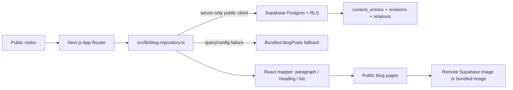
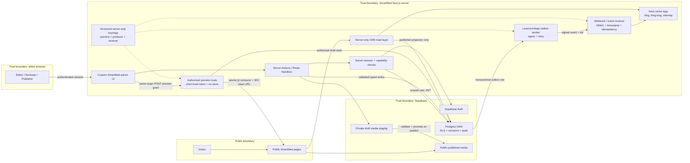
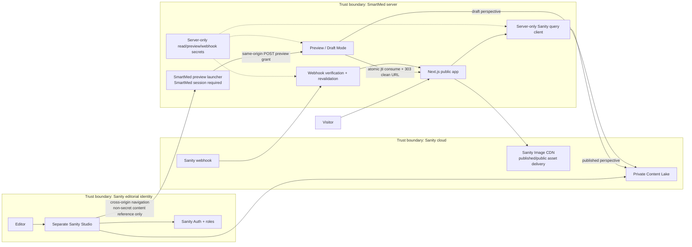

# SmartMed — CMS Integration Readiness and Security Audit

> Status: livrabil final, exclusiv audit
>
> Data auditului: 2026-07-28
>
> Revizia de bază auditată: `23657d9f9930cdc1c16dd2b2bd8d795d54d434c3`
>
> Snapshot worktree auditat: `codex-security-snapshot/v1:sha256:15b1bc84c21bf6e855a1dd0ebab7e58581c8de0e90cf74ed231adfb8ec7aed0a`
>
> Domeniu: întregul worktree curent la momentul scanării, 250 de fișiere
>
> Politica modificărilor: numai analiză; nu au fost efectuate implementarea CMS-ului, instalarea dependențelor, rularea migrărilor, modificarea mediului sau a serviciilor, deployment, commit ori accesarea secretelor.

Clasificarea folosită în raport:

- **Verified fact** — susținut direct de dovezi din repository sau de o comandă locală de validare finalizată.
- **Inference** — concluzie argumentată din fapte verificate în repository.
- **Unknown** — nu poate fi stabilit din repository sau în limitele de validare permise.
- **Recommendation** — stare țintă propusă; nu reprezintă o implementare existentă.

## 1. Executive Summary

| Decizie | Rezultat | Încredere | Motivare |
| --- | --- | --- | --- |
| Readiness rating | **YELLOW — viable but prerequisites must be completed** | Ridicată pentru codul-sursă; medie pentru deployment | Repository-ul conține deja o schemă editorială Supabase substanțială și un adaptor public de citire, însă îi lipsesc o limită sigură pentru operațiunile editoriale, roluri editoriale bazate pe principiul least privilege, preview, revalidare autentificată, dovezi despre starea producției și un flux fiabil de unpublish. |
| Sanity decision | **Not recommended** | Ridicată | Adăugarea Sanity în acest moment ar duplica domeniul CMS existent în Supabase, ar crea două modele de identitate/autorizare și ar introduce o a doua sursă de adevăr, dacă CMS-ul existent nu este retras complet. |
| Recommended Studio model | **Custom SmartMed admin interface** | Ridicată | O interfață de administrare proprie, construită peste CMS-ul Supabase existent, reutilizează tabelele, reviziile, RLS, Storage și autentificarea SmartMed deja implementate. |
| CMS recomandat | Platforma editorială Supabase existentă | Ridicată | Baza de date modelează deja articole, revizii, autori, categorii, taguri, colecții, media, stări de publicare, câmpuri SEO, granturi și politici publice de citire. |

**Verified fact:** SmartMed nu pornește de la un repository fără CMS. Migrarea `supabase/migrations/20260727164654_platform_foundation.sql:280-529` definește tabelele media și editoriale, iar `src/lib/blog-repository.ts:23-457` mapează deja conținutul publicat din Supabase în blogul public.

**Inference:** Calea cu cel mai mic risc este finalizarea și securizarea CMS-ului Supabase existent, urmată de construirea unei interfețe editoriale SmartMed proprii. Sanity este viabil tehnic, dar nu este cea mai potrivită alegere pentru starea actuală a repository-ului.

**Recommendation:** Decizia privind Sanity trebuie tratată ca o decizie privind sursa de adevăr, nu ca o simplă adăugare de UI. Dacă stakeholderii impun Sanity, acesta trebuie folosit numai ca înlocuitor complet, după aprobarea unui plan de migrare și cutover; Sanity și Supabase nu trebuie operate ca platforme CMS paralele, ambele cu drept de scriere.

Cele cinci blocaje cu prioritatea cea mai mare sunt:

1. **Guvernanța sursei de adevăr:** trebuie aprobat fie CMS-ul Supabase existent, fie o înlocuire completă cu Sanity; căile de scriere paralele nu sunt acceptabile.
2. **Autorizarea editorială:** trebuie introduse capabilități distincte `editor`, `reviewer` și `publisher`, verificări server-side, RLS/granturi, cerințe MFA/AAL și atribuirea imuabilă a actorului.
3. **Ciclul de viață al publicării:** trebuie implementate izolarea preview-ului, webhook/revalidare semnată, activarea publicării programate, unpublish imediat, cache tags și tombstones.
4. **Dovezi despre producție:** trebuie stabilite modelul real de hosting, starea migrațiilor/RLS din Supabase hosted, politica pentru cookies/headere, administrarea secretelor, rate limits, backupurile, monitorizarea și starea advisories pentru dependențe.
5. **Pregătirea conținutului și a media:** trebuie clarificate responsabilitatea taxonomiei, cerințele de review medical, metadatele privind drepturile, maparea migrării și fișierul `supabase/seed.sql` așteptat de configurația locală, dar absent.

Scanarea de securitate finalizată a acoperit 250 de fișiere din worktree. Rezultatul a fost **0 vulnerabilități raportabile susținute de codul-sursă**, iar cinci candidați dependenți de runtime au rămas explicit amânați. Acest rezultat nu înseamnă „niciun risc”: auditul confirmă mai multe riscuri de integritate și guvernanță CMS care devin critice pentru securitate odată cu introducerea suprafețelor de scriere editorială, preview, upload și revalidare.

## 2. Audit Scope and Limitations

### Domeniu

**Verified fact:** Auditul a acoperit:

- toate cele 249 de fișiere tracked la revizia de bază `23657d9f9930cdc1c16dd2b2bd8d795d54d434c3`;
- două fișiere de prezentare Atlas modificate local;
- un asset untracked, `src/assets/smartmed-chapter-visual.webp`;
- rutele aplicației, Route Handlers, Server Actions, componentele, bibliotecile, testele, configurația, migrările SQL, template-urile Supabase și asseturile statice;
- pregătirea pentru CMS, autentificarea, autorizarea, RLS, randarea conținutului, publicarea, preview-ul, revalidarea, media, SEO, accesibilitatea, performanța, reziliența, testarea, condițiile prealabile pentru deployment și securitatea.

Cele trei modificări preexistente din worktree au fost păstrate:

```text
 M src/components/module-speciale/atlas-pergamente-section.module.css
 M src/components/module-speciale/atlas-pergamente-section.tsx
?? src/assets/
```

**Verified fact:** După sigilarea scanării, starea Git externă acestui audit a avansat la commitul `2b9add19eaf91285a892b1be82a1acd0fd029b06`, care conține exact cele două modificări Atlas și asset-ul WebP deja incluse în snapshot-ul auditat. Auditul nu a creat acel commit, iar conținutul-sursă evaluat nu s-a schimbat.

**Verified fact:** Delta Atlas este de prezentare. Noul fișier WebP este un fișier RIFF/WebP valid, de 35.208 bytes și 1200×967, fără EXIF, XMP, ICC, URL sau conținut activ. Nu introduce nicio suprafață CMS, de autentificare, API, URL dinamic sau fetch extern.

### Explicit în afara domeniului

- modificarea codului aplicației, în afara creării acestui raport;
- instalarea Sanity sau a oricărei alte dependențe;
- crearea sau rularea migrărilor ori seedurilor pentru baza de date;
- modificarea `.env*`, Supabase, hosting, DNS, CDN, WAF, email, Storage sau a setărilor de deployment;
- contactarea producției sub forma unui penetration test;
- citirea sau reproducerea valorilor secrete;
- deployment, commit, push sau deschiderea unui pull request;
- fuzzing, load testing, scanarea secretelor din istoricul Git sau analiza semantică/steganografică a imaginilor.

### Limitări

- **Unknown:** Repository-ul nu stabilește furnizorul de hosting pentru producție sau topologia de deployment.
- **Unknown:** Nu au fost observate response headerele din producție, HSTS, cookies, CORS, controalele WAF/CDN, rate limits și comportamentul negative cache.
- **Unknown:** Nu au fost verificate starea schemei Supabase hosted, modificările manuale din dashboard, echivalența RLS/granturi, setările Auth, SMTP, backupurile, configurația Storage și monitorizarea.
- **Unknown:** Advisories curente pentru dependențe nu au fost verificate într-o bază de date live de advisories.
- **Unknown:** Nu sunt stabilite proprietarul, mediul și ciclul de viață al URL-ului Supabase non-local din fișierul `.env.local` ignorat. Valorile nu au fost afișate.
- **Verified fact:** Validările existente pentru test, typecheck, lint și production build au trecut pe revizia de bază curată, înainte de apariția deltei Atlas fără legătură cu auditul. Matricea completă nu a fost rulată din nou după acea deltă.

### Interpretarea auditului

Acest raport distinge trei clase diferite:

1. vulnerabilități actuale, susținute de codul-sursă;
2. riscuri confirmate ale integrării CMS, care în prezent nu sunt accesibile unui atacator;
3. cerințe de hardening și verificare a producției.

Absența unui endpoint actual nu este considerată vulnerabilitate. Același control lipsă devine un blocaj de release atunci când este adăugat un endpoint pentru administrare editorială, preview, webhook, upload sau publicare.

## 3. Verified Technology Stack

| Zonă | Fapt verificat | Dovezi |
| --- | --- | --- |
| Runtime | Node.js `>=22.13.0`; `.nvmrc` selectează Node 22 | `package.json:6-7`, `.nvmrc:1` |
| Framework | Next.js `16.2.12`, App Router | `package.json:29`, `src/app/**` |
| UI | React și React DOM `19.2.4` | `package.json:30-31` |
| Limbaj | TypeScript `^5`, strict, bundler resolution, `noEmit` | `package.json:44`, `tsconfig.json` |
| Package manager | npm cu lockfile v3 | `package-lock.json:1-6` |
| Stilizare | Tailwind CSS 4, CSS modules, `styled-components` `6.4.2` | `package.json:32,36,43`, `next.config.ts:3-6` |
| Utilitare de animație/UI | Framer Motion `12.38`, Lucide React, `clsx` | `package.json:26-28` |
| Validare | Zod `4.4.3` | `package.json:33` |
| Client Auth/date | `@supabase/ssr` `0.12.0`, `@supabase/supabase-js` `2.108.2` | `package.json:24-25` |
| Bază de date | Migrări PostgreSQL/Supabase cu RLS, granturi, funcții, triggere și politici Storage | `supabase/migrations/**` |
| Backend de conținut | Schemă editorială Supabase proprie, plus articole fallback incluse în bundle | `supabase/migrations/20260727164654_platform_foundation.sql`, `src/lib/blog-repository.ts`, `src/lib/blog.ts` |
| Testare | Node test runner; un fișier de teste auth/access-control cu șase teste | `package.json:21`, `src/lib/auth/access-control.test.ts:9-47` |
| SDK-uri CMS | Nicio dependență runtime pentru Sanity, Payload, Contentful, MDX sau Markdown | `package.json:23-44` |
| Deployment | **Unknown** | Niciun CI workflow, Dockerfile, deployment manifest sau configurație de hosting nu dovedește platforma de producție |

**Verified fact:** `next.config.ts:3-29` activează compilatorul `styled-components`, redirecționează `/blog-principal` către `/blog` și setează un cache header specific unui asset. Nu definește `images.remotePatterns`, o politică globală pentru security headers sau o strategie de cache CMS.

**Verified fact:** `.env.example:1-16` conține numele URL-ului public Grile, ale URL-ului/cheii publice Supabase și ale configurației viitoare Stripe/Resend. Nu expune valori secrete.

**Recommendation:** Înainte de implementare, trebuie consultată documentația Next.js 16 instalată în repository, din `node_modules/next/dist/docs/`, pentru Draft Mode, API-urile de cache, Route Handlers, Proxy, Server Actions, CSP și configurația imaginilor. Fișierul `AGENTS.md` al repository-ului avertizează explicit că această versiune Next.js conține breaking changes.

## 4. Repository Architecture Map

### Structura curentă a repository-ului

| Path | Responsabilitate curentă | Relevanță pentru CMS |
| --- | --- | --- |
| `src/app/**` | Pagini App Router, Route Handlers pentru auth, rute publice de blog | Livrarea conținutului public; viitoare rute admin/preview/webhook |
| `src/components/blog/**` | Listă, card, detaliu, categorie, hero și template UI pentru blog | Strat de prezentare reutilizabil; rendererul pentru structured content este incomplet |
| `src/lib/blog-repository.ts` | Adaptor server-only de citire Supabase, mapare, filtrare, fallback, căutare și conținut asociat | Limita existentă de citire CMS |
| `src/lib/blog.ts` | Tipuri de domeniu, categorii, șase articole incluse în bundle, helpers statici | Sursă legacy/fallback și taxonomie hardcodată |
| `src/lib/search.ts` | Index static de căutare globală | În prezent ocolește conținutul CMS nou |
| `src/lib/auth/**` | Acțiuni Auth, session/DAL, roluri, validare, clienți Supabase | Fundație pentru un admin SmartMed propriu |
| `src/proxy.ts` | Reîmprospătarea sesiunii și verificări optimiste ale rutelor | Insuficient ca autorizare finală |
| `supabase/migrations/**` | Profiluri, roluri, CMS, revizii, granturi, RLS, Storage, import seed | Planul existent de date și politici CMS |
| `supabase/config.toml` | Configurația locală Supabase/Auth/API/Storage | Constrângeri locale; nu reprezintă dovada setărilor hosted |
| `public/**`, `src/assets/**` | Media inclusă în bundle | Media statică actuală și input pentru o viitoare migrare |
| `docs/technical-audit.md` | Audit tehnic anterior | Depășit în raport cu implementarea CMS/auth curentă |

### Fluxul curent al conținutului public



**Verified fact:** Filtrarea conținutului public impune status publicat, vizibilitate publică și atingerea momentului de publicare în `src/lib/blog-repository.ts:368-405`.

**Verified fact:** Aceeași funcție din repository revine la articolele incluse în bundle când lipsește configurația, la o eroare de query sau la o excepție de request. Comportamentul susține disponibilitatea, dar nu este sigur pentru un takedown autoritativ.

**Inference:** Repository-ul are deja cea mai mare parte a unui data plane pentru headless CMS, dar nu și control plane-ul editorial.

## 5. Existing Core Functionality

### Aplicația publică

**Verified fact:** Aplicația conține pagini publice de marketing și educaționale pentru centrul SmartMed, oferta online, module speciale, simulări, magazin, știri, blog, ajutor, contact, confidențialitate și termeni.

**Verified fact:** App Router expune în prezent 27 de module de pagină, două Route Handlers și șase Server Actions.

### Autentificare și cont

**Verified fact:** Fluxurile implementate includ login, signup, logout, resetarea parolei, actualizarea parolei, actualizarea profilului, schimbul din auth callback, reîmprospătarea sesiunii și un rezumat read-only al sesiunii.

### Blog și căutare

**Verified fact:** `/blog` acceptă filtrare după categorie și query. `/blog/[slug]` generează static slugurile cunoscute și permite parametri dinamici. Există carduri, prezentarea detaliului, articole asociate, metadata și conținut fallback.

**Verified fact:** Căutarea globală importă colecția statică `blogPosts`, nu repository-ul Supabase, astfel că afișarea conținutului CMS nou nu este garantată.

### Fundația bazei de date

**Verified fact:** Migrarea platformei Supabase conține domenii dincolo de conținut: conturi, entitlements, cursuri, comerț, programare, notificări, media, audit și Storage.

### Funcționalitate absentă

Următoarele elemente sunt **absente în mod verificat din repository**, nu presupuse defecte:

- rută pentru admin editorial sau Sanity Studio;
- model de roluri editor/reviewer/publisher;
- acțiuni de scriere CMS sau Route Handlers;
- Draft Mode sau rută de preview autorizată;
- receiver pentru webhook CMS;
- integrare `revalidateTag`/`revalidatePath`;
- job de activare a publicării programate;
- flux media upload/editor;
- trigger de audit editorial care leagă ID-urile actorilor;
- sitemap, robots, Article JSON-LD sau flux de corecții;
- dovezi privind deployment-ul în producție.

## 6. Authentication and Authorization

### Modelul curent

| Aspect | Evaluare | Dovezi |
| --- | --- | --- |
| Vocabularul rolurilor | **Verified fact:** `guest`, `user`, `premium`, `admin`; nu există roluri editoriale | `src/lib/auth/access-control.ts:1-18` |
| Registrul rutelor protejate | **Verified fact:** gol | `src/lib/auth/access-control.ts:16-18` |
| Identitatea sesiunii | **Verified fact:** serverul folosește `auth.getUser()` și query-uri pentru profil/rol/entitlement susținute de baza de date | `src/lib/auth/session.ts:44-123` |
| Proxy | **Verified fact:** reîmprospătează sesiunea și execută verificări optimiste; comentariile cer autorizare lângă date/pagină | `src/proxy.ts:43-95` |
| Server Actions | **Verified fact:** sunt folosite validarea Zod și ID-uri de utilizator derivate din sesiune pe server | `src/lib/auth/actions.ts`, `src/lib/auth/validation.ts` |
| CSRF/CORS curent | **Verified fact:** mutațiile de aplicație/formular sunt Server Actions și nu există un API de mutație cu CORS permisiv; separat, auth callback este un flow `GET` stateful care verifică PKCE/OTP și poate scrie cookie-uri de sesiune | `src/lib/auth/actions.ts`, `src/app/auth/callback/route.ts:32-96`, `src/app/auth/session/route.ts` |
| Siguranța redirecturilor | **Verified fact:** sanitizerul same-origin respinge path-uri externe, protocol-relative, cu backslash sau caractere de control; șase teste trec | `src/lib/auth/access-control.ts:37-65`, `src/lib/auth/access-control.test.ts:9-47` |
| Autorizarea bazei de date | **Verified fact:** politicile asupra datelor utilizatorului se bazează pe `auth.uid()`; politicile CMS publice filtrează starea publicării | `supabase/migrations/20260727164654_platform_foundation.sql:2477-2761` |
| Aria adminului | **Verified fact:** `private.is_admin()` acordă o capabilitate administrativă amplă, peste mai multe domenii | `supabase/migrations/20260727164654_platform_foundation.sql:1938-1953,3666-3712` |

### Implicații pentru autorizarea CMS

**Verified fact:** Nu există în prezent o rută editorială care să poată fi atacată, astfel că registrul gol al rutelor protejate nu reprezintă acum un bypass de admin.

**Recommendation:** Editorii de conținut nu trebuie mapați la rolul global `admin`. Acest rol acoperă domenii editoriale și operaționale și încalcă principiul least privilege pentru authoring de rutină.

**Recommendation:** Trebuie definite capabilități, în locul unei singure ierarhii:

| Capabilitate | Editor | Reviewer | Publisher | Platform admin |
| --- | ---: | ---: | ---: | ---: |
| Creează/editează propriul draft | Da | Da | Da | Da |
| Editează orice draft | Opțional conform politicii | Da | Da | Da |
| Trimite pentru review | Da | Da | Da | Da |
| Înregistrează review-ul medical | Nu | Da | Opțional | Da |
| Publish/schedule/unpublish | Nu | Nu | Da | Da |
| Administrează taxonomia | Limitat | Limitat | Da | Da |
| Administrează utilizatorii editoriali | Nu | Nu | Nu | Da |
| Accesează administrarea non-CMS a platformei | Nu | Nu | Nu | Da |

Controale obligatorii:

- autentificarea editorului pe server pentru fiecare mutation;
- autorizarea acțiunii și obiectului concrete, nu doar a rutei;
- reflectarea autorizării în granturi/RLS PostgreSQL sau în funcții `SECURITY DEFINER` cu arie restrânsă;
- impunerea MFA/AAL2 sau a unei autentificări recente pentru acțiunile de publisher și administrare a rolurilor;
- derivarea `created_by`/`updated_by` din `auth.uid()` în logica de încredere a bazei de date;
- crearea de evenimente de audit append-only pentru review, publish, schedule, unpublish, corecție, restore și modificări ale permisiunilor;
- împiedicarea utilizatorilor obișnuiți să citească drafturi, revizii, metadata private și staging media;
- pentru orice viitor Route Handler cookie-authenticated care modifică starea, sursa autoritativă este allowlist-ul server-only `CMS_CANONICAL_ORIGINS`, nu comparația dintre două headere primite. `Origin` lipsă, malformed sau absent din allowlist și un `Host` care nu corespunde aceleiași origini sunt refuzate fail-closed. `Forwarded`/`X-Forwarded-Host` sunt ignorate implicit; pot fi consumate numai de un adaptor specific deployment-ului după dovada că ingress-ul nominalizat elimină valorile clientului, suprascrie headerul și blochează accesul direct la origin. Testele acoperă toate aceste cazuri, nu numai cross-origin; protecția implicită a Server Actions nu trebuie presupusă pentru Route Handlers;
- webhook-ul server-to-server nu trebuie să activeze CORS permisiv și se autentifică prin semnătură, nu prin cookie;
- auth callback-ul `GET` stateful trebuie păstrat separat de mutațiile editoriale și validat prin integritatea/expirarea PKCE sau OTP, consum one-time și cookie policy; existența metodei `GET` nu este prezentată singură ca vulnerabilitate;
- Proxy nu trebuie tratat niciodată ca limită finală de autorizare.

### Riscuri de autentificare dependente de runtime

- **Unknown:** atributele `Set-Cookie` reale din producție și comportamentul HSTS;
- **Unknown:** dacă Supabase hosted impune autentificare recentă pentru actualizarea parolei;
- **Unknown:** dacă comportamentul duplicate-signup din mediul hosted suprimă enumerarea explicită a conturilor;
- **Recommendation:** aceste necunoscute trebuie închise într-un mediu de staging controlat înainte de acordarea privilegiilor editoriale.

## 7. Existing Blog and Content Functionality

### Comportamentul curent

| Capabilitate | Stare curentă | Dovezi |
| --- | --- | --- |
| Lista articolelor publicate | Implementată prin Supabase, cu fallback inclus în bundle | `src/lib/blog-repository.ts:368-408` |
| Detaliu după slug | Implementat prin încărcarea întregului conținut publicat și căutare în memorie | `src/lib/blog-repository.ts:410-417` |
| Căutare | Pagina blogului poate filtra rezultatele CMS încărcate; căutarea globală rămâne statică | `src/lib/blog-repository.ts:419-457`, `src/lib/search.ts:172-232` |
| Categorii | Union TypeScript hardcodat plus relație în baza de date; valorile necunoscute folosesc fallback | `src/lib/blog.ts:1-75`, `src/lib/blog-repository.ts:186-202` |
| Articole asociate | Filtru in-memory peste întregul corpus publicat | `src/lib/blog-repository.ts:447-457` |
| Structured content | Paragraf, heading, listă neordonată | `src/lib/blog-repository.ts:150-183` |
| Siguranța randării | Noduri text React; fără raw HTML/MDX/iframe arbitrar | `src/components/blog/blog-post-page.tsx:140-155` |
| Generare statică | Slugurile cunoscute ale articolelor sunt generate la build; `dynamicParams = true` | `src/app/blog/[slug]/page.tsx:18-24` |
| Invalidarea cache-ului | Nu există cale de revalidare CMS | Inventarul rutelor/API din repository |
| Imagini | Media inclusă în bundle și media publică Supabase; imaginile remote folosesc `unoptimized` | `src/components/blog/blog-post-page.tsx:27-85`, `src/components/blog/blog-article-card.tsx:41-95` |
| Seed | Migrarea aditivă importă șase articole incluse în bundle | `supabase/migrations/20260727172332_seed_initial_cms.sql:1-7,320-436` |

### Puncte forte

- filtrele de publicare sunt explicite;
- clientul repository este server-only și folosește o publishable key;
- randarea curentă eșuează în mod închis pentru blocurile de body necunoscute;
- schema include revizii, taxonomie, media, colecții, vizibilitate, status, scheduling și câmpuri SEO;
- există RLS public;
- conținutul inclus în bundle permite citirea degradată controlat atunci când backend-ul nu este disponibil.

### Lacune

- nu există garanția că unpublish și corecțiile produc efect fără redeployment;
- fallback-ul poate readuce la viață conținut istoric retras;
- query-urile detail/search/related încarcă un corpus inutil de larg, inclusiv bodies și joins;
- căutarea globală poate omite adăugări din CMS sau poate păstra articole retrase din bundle;
- taxonomia este parțial hardcodată în TypeScript;
- rendererul nu poate exprima linkuri, emphasis, imagini, captions, citate, callouts medicale, referințe sau video;
- câmpurile SEO prezente în baza de date nu sunt proiectate complet în metadata publică;
- nu există preview, webhook, cache tags durabile, pagination, sitemap sau registru de corecții.

**Recommendation:** După ce CMS-ul devine autoritativ, setul de articole inclus în bundle trebuie eliminat din calea publică fail-open. În locul său trebuie folosit un cache public last-known-good, cu tombstones explicite și staleness limitat.

## 8. CMS Functional Requirements

### P0 — obligatoriu înaintea accesului editorial

1. **Identitate și least privilege**
   - capabilități editor/reviewer/publisher/admin;
   - autorizare server-side pentru fiecare read/write;
   - paritate cu politicile bazei de date;
   - cerințe MFA/recent-auth pentru acțiunile privilegiate.
2. **Workflow editorial**
   - draft → review → approved → scheduled/published → archived/unpublished;
   - respingere și retrimitere;
   - aprobare formală a review-ului medical;
   - istoric imuabil al reviziilor și diff;
   - audit trail atribuibil.
3. **Conținut sigur**
   - allowlist tipizat pentru blocuri;
   - fără raw HTML;
   - politică strictă pentru linkuri și embeds;
   - validarea metadata obligatorii.
4. **Preview**
   - sesiune de editor autentificată;
   - token de preview short-lived și scoped;
   - `no-store` și izolarea draftului;
   - fără redirect arbitrar.
5. **Publicare și takedown**
   - revalidare semnată, replay-aware și idempotentă;
   - unpublish imediat;
   - invalidare la schimbarea slugului;
   - activare programată;
   - tombstones pentru cache.
6. **Media**
   - staging privat pentru drafturi;
   - verificări de tip/magic/decode/re-encode;
   - limite de dimensiune și rezoluție;
   - drepturi, attribution, alt text și captions;
   - promovare în public numai la publish.

### P1 — obligatoriu pentru publicare la calitate de producție

- modele pentru category, tag, author, reviewer, series/collection, references și corrections;
- proiecții separate pentru listă și detaliu;
- query direct, indexat, după slug;
- pagination și căutare limitată;
- canonical pentru articol, Open Graph, Twitter, JSON-LD și sitemap;
- monitorizare pentru publish, webhook, cache, media și joburi programate eșuate;
- validare backup/restore și rollback;
- reconcilierea migrării conținutului;
- verificări de accesibilitate și ghid editorial.

### P2 — poate fi amânat

- tabele avansate și vizualizări de date;
- galerii;
- embeds third-party generice;
- editare colaborativă dincolo de capabilitatea nativă a CMS-ului selectat;
- automatizare complexă a workflow-ului;
- localizare;
- authoring asistat de AI;
- layout builder generic.

**Recommendation:** Pentru primul release nu trebuie construit un page builder generic. Conținutul editorial medical beneficiază de un model de blocuri restrâns și ușor de revizuit.

## 9. Sanity Suitability Assessment

### Decizie

**Sanity suitability: Not recommended.**

Aceasta nu este o evaluare conform căreia Sanity ar fi un produs nepotrivit. Este o concluzie specifică acestui repository: SmartMed are deja o bază de date editorială personalizată, revizii, politici, date seed, un model media și un adaptor public.

### Compararea opțiunilor

| Opțiune | Potrivire | Beneficii | Costuri/riscuri | Decizie |
| --- | --- | --- | --- | --- |
| Sanity Studio separat + Sanity Content Lake | Medie dacă înlocuiește Supabase | Experiență matură de editare, instrumente pentru schemă, asset-uri, ecosistem de preview | Model nou de identitate, migrare, al doilea datastore, strat nou de interogare/randare, comportament nou al asset-urilor, implicații de cost pentru un dataset privat | Condiționat, numai ca înlocuire completă |
| Sanity Studio încorporat la `/studio` | Scăzută | O singură suprafață de deployment | Leagă disponibilitatea/build-ul/CSP-ul Studio de aplicația publică; SmartMed Proxy nu protejează Sanity Auth; extinde domeniul de dependențe și defectare | Nerecomandat |
| Interfață de administrare SmartMed personalizată peste Sanity | Foarte scăzută | Brand unificat | Reimplementează o mare parte din Studio, dar adaugă în continuare Content Lake și un al doilea plan de autentificare/date | Nerecomandat |
| Interfață de administrare SmartMed personalizată peste CMS-ul Supabase existent | Ridicată | Reutilizează SmartMed Auth, schema, reviziile, RLS, Storage, datele seed și adaptorul | Necesită construirea experienței editoriale și consolidarea guvernanței | **Recomandat** |

### De ce adăugarea Sanity în paralel este nesigură

**Inference:** Introducerea Sanity în paralel creează ambiguitate pentru:

- ID-urile și slug-urile autoritative ale articolelor;
- stările draft/review/published;
- corectarea și retragerea conținutului;
- autori, recenzori, categorii, tag-uri și serii;
- proprietatea și URL-urile media;
- căutare și sitemap;
- evenimente de preview și webhook;
- audit și recuperare;
- CMS-ul care prevalează atunci când înregistrările diferă.

### Condiții dacă Sanity este impus

Dacă o decizie de business prevalează asupra acestei recomandări:

1. utilizați Sanity ca **înlocuire completă**, nu ca sistem paralel în care se poate scrie;
2. faceți deployment pentru Studio separat de aplicația publică SmartMed Next.js;
3. utilizați Sanity Auth drept graniță autoritativă de identitate pentru Studio;
4. utilizați un dataset privat;
5. păstrați token-urile de read/write/preview exclusiv pe server;
6. utilizați perspectiva published pentru citirile publice și preview autentificat pentru draft-uri;
7. migrați și reconciliați toate entitățile, elementele media, slug-urile, reviziile, datele SEO și relațiile;
8. realizați un cutover controlat, fără perioadă de dual-write;
9. retrageți citirile publice din CMS-ul Supabase, fallback-ul inclus în bundle și politicile editoriale devenite inutile după acceptanță;
10. documentați faptul că URL-urile asset-urilor Sanity pot rămâne accesibile public chiar dacă documentele dataset-ului sunt private și alegeți o strategie separată pentru media protejată acolo unde este necesară confidențialitatea.

### Dovezi din documentația Sanity

- [Embedding Sanity Studio in Next.js](https://www.sanity.io/docs/nextjs/embedding-sanity-studio-in-nextjs)
- [Studio deployment](https://www.sanity.io/docs/studio/deployment)
- [Visual Editing with Next.js App Router](https://www.sanity.io/docs/nextjs/visual-editing-with-next-js-app-router)
- [Webhooks HTTP reference](https://www.sanity.io/docs/http-reference/webhooks)
- [Webhook best practices](https://www.sanity.io/docs/content-lake/webhook-best-practices)
- [Datasets](https://www.sanity.io/docs/content-lake/datasets)
- [Drafts](https://www.sanity.io/docs/content-lake/drafts)
- [Roles](https://www.sanity.io/docs/user-guides/roles)
- [Presenting and previewing content](https://www.sanity.io/docs/content-lake/presenting-and-previewing-content)
- [Keeping data safe](https://www.sanity.io/docs/content-lake/keeping-your-data-safe)

## 10. Recommended Integration Architecture

### Arhitectura activă recomandată — CMS-ul Supabase existent



Proprietăți de securitate:

- codul din browser nu primește niciodată secrete de tip database superuser, service-role, webhook sau preview;
- operațiile obișnuite de scriere se execută în identitatea editorului autentificat și rămân supuse politicilor bazei de date;
- operațiile excepționale din fundal folosesc o funcție server-only cu permisiuni strict limitate, nu un token general de client;
- elementele media din draft sunt private;
- citirile publice sunt separate de interogările de administrare;
- preview-ul ocolește cache-urile partajate;
- payload-urile webhook nu pot alege path-uri sau cache tags arbitrare;
- evenimentele sunt semnate de producer-ul/outbox worker identificat; HMAC-ul folosește un keyring versionat disponibil controlat la ambele capete sau o semnătură asimetrică păstrează cheia privată numai la producer;
- operația unpublish scrie un tombstone înainte de invalidare.

### Arhitectura condiționată de înlocuire cu Sanity

Diagrama următoare reprezintă o alternativă numai dacă Sanity este selectat în mod oficial ca înlocuitor:



**Recommendation:** Pentru un Sanity Studio separat, Studio nu trimite direct un `POST` cookie-authenticated către SmartMed. El poate deschide numai launcher-ul SmartMed cu o referință non-secretă la document; launcher-ul cere o sesiune și capabilitate SmartMed valide, emite grantul și face `POST` same-origin către ruta de preview. O alternativă cross-origin ar necesita autentificare server-to-server dedicată, fără cookies, și un threat model separat.

**Recommendation:** Nu implementați arhitectura condiționată din diagramă înainte ca planul de migrare și retragere a CMS-ului Supabase să fie aprobat.

## 11. Proposed Content Model

Modelul țintă este independent de platformă și se mapează natural pe tabelele Supabase existente. Tipurile de documente Sanity echivalente sunt doar o opțiune condiționată.

| Model | Formă | Mapare Supabase existentă | Completări necesare |
| --- | --- | --- | --- |
| Article | Entitate/document separat | `content_entries` + `content_revisions` | stare pentru medical review, politică de corecție, istoric canonical |
| Author | Entitate separată reutilizabilă | `content_authors` | acreditări, biografie, URL de profil, stare activă |
| MedicalReviewer | Entitate separată reutilizabilă | Nu există o entitate dedicată verificată | specialitate, acreditări, data/ora recenziei și declarație |
| Category | Taxonomie separată | `content_categories` | guvernanță, canonical slug, ordonare |
| Tag | Taxonomie separată | `content_tags` | guvernanță și utilizare limitată |
| Series/Collection | Entitate separată reutilizabilă | `content_collections` și relațiile aferente | ordinea seriei și semantica publică |
| SEO | Obiect încorporat pentru fiecare articol | câmpurile SEO din `content_entries` | canonical, imagine socială, robots, suprascrieri pentru structured data |
| References | Array structurat pentru fiecare revizie a articolului | Poate fi stocat în body/metadata ale reviziei | tipul citării, titlu, autori, sursă, URL, DOI, data accesării |
| CorrectionNotice | Înregistrare separată de tip append-only | Nu există un model dedicat verificat | textul corecției, motiv, actor, timestamp, revizia afectată |
| MediaAsset | Metadata separate pentru asset | `media_assets` | ciclul de viață draft/public, drepturi, atribuire, checksum, starea scanării |
| ImagePlacement | Bloc încorporat | Body JSON | referință către asset, alt, descriere, credit, crop/focal point |
| YouTubeBlock | Bloc încorporat | Body JSON | ID video normalizat, titlu, transcript/rezumat, mod de consimțământ |

### Câmpuri obligatorii pentru Article

- ID intern stabil;
- titlu și canonical slug;
- excerpt/dek;
- stare și vizibilitate;
- autor și recenzor medical;
- categorie și tag-uri;
- blocuri de conținut;
- imagine de copertă;
- titlu și descriere SEO;
- timestamp-uri pentru publicare, actualizare, recenzie și expirare;
- suprascrierea URL-ului canonical numai atunci când este necesară;
- referințe;
- declarația de recenzie;
- metadata pentru revizie și audit.

### Blocuri structurate inițiale

Permiteți în prima versiune:

- paragraf;
- heading de nivel 2 și 3;
- listă ordonată și neordonată;
- marcaje strong și emphasis;
- link intern/extern sigur;
- imagine cu alt/descriere/drepturi;
- YouTube prin ID normalizat;
- citat de tip block quote;
- callout important/de avertizare/medical;
- secțiune de referințe.

Amânați:

- HTML brut;
- iframe arbitrar;
- MDX sau componente executabile;
- URL generic pentru embed;
- tabele;
- galerii;
- secțiuni de layout arbitrare.

### Flux de lucru

```text
draft -> in_review -> approved -> scheduled|published -> archived|unpublished
              \-> changes_requested -> draft
published -> correction_pending -> published corrected revision
```

Invariante de publicare:

- numai o revizie aprobată poate deveni publică;
- revizia publicată trebuie să aparțină aceluiași articol;
- medical review este obligatoriu pentru clasele configurate de conținut medical;
- ora programării este validată în UTC;
- unicitatea slug-ului este impusă;
- conținutul archived/unpublished este eliminat imediat din fiecare proiecție publică;
- fiecare tranziție înregistrează actorul derivat pe server.

## 12. Images and YouTube Handling

### Pipeline pentru imagini

**Verified fact:** Bucket-ul public Storage curent este `public-media`, iar adaptorul CMS actual construiește URL-uri numai pentru acest bucket exact. Nu există un flux privat pentru imaginile draft.

**Recommendation:** Implementați:

1. upload într-un bucket privat de staging;
2. impunerea limitelor pentru dimensiunea fișierului și dimensiunile în pixeli;
3. verificarea magic bytes și decodarea imaginii;
4. respingerea sau recodificarea formatelor active/ambigue; SVG nu trebuie acceptat în MVP;
5. eliminarea EXIF și a altor metadata care nu sunt necesare;
6. rularea opțională a unei scanări malware acolo unde politica de amenințări/riscuri o impune;
7. obligativitatea regulilor pentru drepturi, sursă, atribuire, text alt și descriere;
8. stocarea checksum, width, height, MIME și a stării de procesare;
9. promovarea unui derivat validat în zona media publică numai când revizia căreia îi aparține este publicată;
10. ștergerea sau plasarea în carantină, după un program controlat, a obiectelor orfane din staging.

**Verified fact:** Cel puțin un fișier inclus în bundle demonstrează de ce sunt necesare verificările semnăturii: `public/images/special-modules/imagistica-smart/6-imagistica-smart-1.png` conține date JPEG/JFIF, în ciuda extensiei `.png`. Fișierul este pasiv și nu reprezintă o vulnerabilitate actuală.

### Livrarea imaginilor prin Next.js

- configurați un host/path exact în `images.remotePatterns` pentru originea media selectată;
- eliminați `unoptimized` acolo unde optimizer-ul este sigur și compatibil;
- persistați width și height;
- setați `sizes` responsive;
- limitați calitatea și formatele de output;
- nu acceptați de la editori URL-uri arbitrare pentru imagini remote;
- păstrați obiectele private/draft în afara cache-urilor publice ale optimizer-ului.

### Bloc YouTube

Stocați numai un ID video YouTube care corespunde exact expresiei `^[A-Za-z0-9_-]{11}$`, împreună cu metadata editoriale. Nu stocați HTML iframe arbitrar sau URL-uri arbitrare.

Cerințe de randare:

- utilizați `https://www.youtube-nocookie.com/embed/<id>`;
- solicitați un titlu accesibil;
- utilizați un container responsive cu aspect-ratio;
- folosiți lazy-load sau click-to-load după exprimarea consimțământului;
- furnizați un transcript sau un rezumat relevant;
- construiți iframe-ul numai în aplicație, cu politica explicită `sandbox="allow-scripts allow-same-origin allow-presentation allow-popups"`, `allow="accelerometer; autoplay; encrypted-media; gyroscope; picture-in-picture; fullscreen"` și `referrerPolicy="strict-origin-when-cross-origin"`;
- interziceți `allow-top-navigation`, `allow-forms`, `allow-modals` și orice capabilitate suplimentară până la un review separat;
- definiți CSP `frame-src` pentru originea exactă cu protecție sporită a confidențialității;
- respingeți toate celelalte host-uri, scheme, origini controlate prin query, playlist-uri și atribute iframe, cu excepția cazului în care sunt modelate și analizate separat.

## 13. Publication, Preview and Caching Flow

### Starea actuală

**Verified fact:** Rutele cunoscute ale articolelor sunt generate static, nu există un endpoint de revalidare CMS, iar fallback-ul inclus în bundle poate expune din nou conținut retras.

### Fluxul de publicare țintă

1. Editor-ul salvează un draft tipizat ca revizie nouă, imuabilă.
2. Reviewer-ul înregistrează rezultatul recenziei și aprobarea medicală acolo unde aceasta este obligatorie.
3. Publisher-ul selectează revizia aprobată și o publică sau o programează.
4. Logica bazei de date actualizează atomic pointerii de publicare, evenimentele de audit și un rând în outbox.
5. Un producer/outbox worker cu privilegii strict limitate citește evenimentul și semnează raw body-ul care conține `kid`, event ID, article ID, slug-urile canonical vechi/noi, operația și timestamp-ul.
6. SmartMed verifică `kid`, semnătura constant-time peste raw bytes, fereastra temporală, dimensiunea body-ului și idempotency. Pentru HMAC, keyring-ul versionat este administrat la ambele capete; alternativ, producer-ul păstrează cheia privată, iar receiver-ul numai cheile publice.
7. Codul de pe server derivă tags/path-uri permise din starea de încredere a bazei de date.
8. Acesta revalidează:
   - `blog`;
   - `blog:<slug>`;
   - slug-ul anterior în cazul redenumirii;
   - `sitemap`;
   - proiecțiile pentru taxonomie/căutare.
9. Citirile publice interoghează o proiecție published separată pentru sumar/detalii.
10. Unpublish creează mai întâi un tombstone, apoi invalidează fiecare proiecție; fallback-ul nu poate reactiva articolul.

### Strategie de cache

**Recommendation:** În Next.js 16, selectați primitiva de cache numai după citirea documentației instalate. Semantica țintă este:

- interogările pentru sumar și detalii sunt separate;
- tags stabile includ `blog`, `blog:<slug>`, `taxonomy:<slug>` și `sitemap`;
- preview-ul este întotdeauna `private, no-store`;
- apelanții webhook nu pot furniza cache tags arbitrare sau path-uri asemănătoare celor din filesystem;
- slug-urile aleatoare inexistente beneficiază de negative caching limitat și rate limiting;
- un miss CMS temporar nu este păstrat în cache ca 404 durabil;
- fallback-ul last-known-good respectă tombstone-urile unpublish și o fereastră stale maximă.

### Preview

- editor-ul trebuie să aibă o sesiune SmartMed validă și capabilitatea de preview;
- grantul are durată scurtă, este semnat, are un singur scop, conține `jti`/nonce și este legat de un articol/o revizie;
- interfața admin îl trimite numai prin `POST` same-origin, într-un body care nu este înregistrat; callback-ul consumă atomic `jti`/nonce-ul și respinge replay-ul;
- după consum, callback-ul răspunde `303` cu `Cache-Control: private, no-store` și `Referrer-Policy: no-referrer` către un URL curat, fără token în URL, logs, browser history sau referrer;
- destinația redirect-ului este derivată din canonical slug, nu acceptată ca URL arbitrar;
- datele draft sunt citite server-side;
- niciun răspuns de preview nu intră într-un cache public partajat;
- accesul este înregistrat fără stocarea valorilor token-ului;
- secretele de preview nu ajung niciodată în bundle-urile browser-ului.

### Conținut programat

**Recommendation:** Alegeți un mecanism fiabil de activare:

- scheduler/queue al bazei de date care emite același eveniment idempotent de publicare; sau
- scheduler al platformei de hosting care invocă un endpoint autentificat și strict limitat.

Nu vă bazați pe faptul că o înregistrare cu dată viitoare devine vizibilă fără o invalidare corespunzătoare a cache-ului.

## 14. Security Findings

### Vulnerabilități existente

Scanarea standard finalizată a identificat **0 vulnerabilități raportabile susținute de dovezi din codul sursă**.

| ID | Severity | Confidence | Evidence | Impact | Required remediation |
| --- | --- | --- | --- | --- | --- |

Tabelul este intenționat fără rânduri: niciun finding nu a trecut porțile de validare și reportability.

#### Candidați deferred — nu sunt findings

Acești candidați nu primesc o severitate actuală. Coloana „Severitate provizorie dacă se confirmă” descrie numai calibrarea posibilă după închiderea proof gap-ului.

| ID | Status | Severitate provizorie dacă se confirmă | Confidence | Evidence și proof gap | Validare necesară |
| --- | --- | --- | --- | --- | --- |
| SEC-D01 | Deferred | Medium | Moderate confidence | Clienții Supabase SSR nu setează opțiuni explicite pentru cookie-uri: `src/lib/auth/supabase.ts:23-44`, `src/proxy.ts:43-61`, `src/lib/auth/supabase-browser.ts:20-23`; atributele reale și HSTS sunt necunoscute | Capturați `Set-Cookie`/HSTS în staging și validați `Secure`, `SameSite`, `HttpOnly`, host scope și primul hop HTTP fără a expune tokenuri |
| SEC-D02 | Deferred | Low | Moderate confidence | Nu există la nivel de repository CSP, frame, MIME, referrer, permissions sau HSTS: `next.config.ts:3-29`; headerele upstream și un exploit complementar nu sunt demonstrate | Verificați matricea de headere din deployment și controalele de framing/transport |
| SEC-D03 | Deferred | Low | Moderate confidence | Actualizarea parolei verifică sesiunea, dar aplicația nu impune recent-auth/AAL; local `secure_password_change=false`: `src/lib/auth/actions.ts:261-298`, `supabase/config.toml:230-235`; politica hosted este necunoscută | Testați un cont controlat cu sesiune stale și impuneți recent auth/AAL2 pentru conturi privilegiate |
| SEC-D04 | Deferred | Low | Moderate confidence | Mapare explicită pentru `email_exists`/`user_already_exists`: `src/lib/auth/actions.ts:39-47,181-217`; provider-ul hosted poate uniformiza deja răspunsurile | Comparați în staging răspunsurile, statusul și timing-ul pentru adresă existentă/inexistentă |
| SEC-D05 | Deferred | Medium | Moderate confidence | Un slug aleator poate ajunge la query-ul întregului corpus: `src/app/blog/[slug]/page.tsx:18-53`, `src/lib/blog-repository.ts:368-417`; cache-ul, rate limits și impactul material sunt necunoscute | Rulați un load test limitat cu slug-uri distincte și măsurați query count, cache, p95 și cotă |

Candidați validați și respinși ca vulnerabilități actuale:

- open redirect: blocat de `sanitizeInternalPath` și de șase teste care trec;
- stored/reflected blog XSS: mapper-ul și renderer-ul React actuale folosesc fail closed;
- SSRF prin media CMS actuală: originea și path-ul bucket-ului sunt de încredere/limitate;
- bypass IDOR/RLS: niciun bypass actual susținut de codul sursă nu a rămas valid după urmărirea politicilor;
- secrete comise în repository: nu a fost găsit niciunul în worktree-ul auditat;
- conținut SVG activ: nu a fost găsit în setul SVG analizat;
- SSG/fallback stale: risc de integritate a conținutului confirmat, însă nicio sursă draft/confidențială nu ajunge în prezent în fallback.

### Riscuri de integrare CMS

| ID | Severity | Confidence | Evidence | Impact | Required remediation |
| --- | --- | --- | --- | --- | --- |
| CMS-R01 | Medium | High confidence | Generare statică a articolelor fără revalidare CMS și fallback fail-open inclus în bundle: `src/app/blog/[slug]/page.tsx:18-24`, `src/lib/blog-repository.ts:368-408` | Conținutul medical retras sau corectat poate rămâne public ori poate reapărea | Invalidare semnată, tombstone-uri, cache last-known-good cu limite și unpublish autoritativ |
| CMS-R02 | High | High confidence | Severitate High la integration gate. Nu există în prezent roluri editor/reviewer/publisher; rolul global admin este extins: `src/lib/auth/access-control.ts:1-18`, migration `:1938-1953,3666-3712` | Editorii ar putea primi acces la funcții de administrare fără legătură cu activitatea editorială | Capabilități dedicate, verificări pe server, RLS/grants, MFA/AAL2 |
| CMS-R03 | Medium | High confidence | Câmpurile pentru actor sunt coloane writable, iar `private.audit_log` nu are un writer CMS verificat: migration `:389-418,1670-1683` | Administratorii autorizați pot omite/falsifica atribuirea; non-repudiation slab | Legați actorul prin logică de încredere în baza de date și emiteți evenimente de audit append-only |
| CMS-R04 | Medium | High confidence | `public-media` este public și nu există un uploader privat pentru draft-uri: migration `:3774-3838` | Imaginile draft sau aflate sub embargo ar putea deveni publice înaintea publicării articolului | Staging privat, validare, promovare la publicare și acces privat semnat |
| CMS-R05 | Medium | High confidence | Risc condiționat. Înregistrările publice de conținut/media expun metadata JSON generice în baza politicilor/grants publice | Notele reviewer-ului, PII sau metadata operaționale s-ar putea scurge dacă sunt modelate în JSON public | Separați câmpurile/tabelele editoriale private și folosiți un allowlist pentru proiecțiile publice |
| CMS-R06 | High | High confidence | Severitate High la integration gate. Rutele pentru preview, webhook, revalidare și mutații editoriale lipsesc | Un endpoint improvizat ar putea expune draft-uri sau permite abuzarea cache-ului | Implementați arhitecturile definite pentru preview autentificat și webhook semnat, idempotent |
| CMS-R07 | Medium | High confidence | Risc condiționat. Helper-ele generice existente pentru link-uri tratează `startsWith("http")` drept extern | Scheme/host-uri nesigure controlate din CMS ar putea ajunge în navigare dacă helper-ele sunt reutilizate | Analizați cu `new URL`, permiteți `https:` și host-uri aprobate, limitați path-urile relative |
| CMS-R08 | Medium | High confidence | Union hardcoded pentru categorii și căutare globală statică: `src/lib/blog.ts`, `src/lib/search.ts` | Înregistrările CMS noi/retrase diferă între blog, căutare, taxonomie și sitemap | Un singur model autoritativ de citire, migrarea taxonomiei, invalidarea căutării/sitemap-ului |
| CMS-R09 | Medium | High confidence | Nu există un CorrectionNotice dedicat și nici impunerea medical-review | Corecțiile medicale pot suprascrie istoricul sau pot fi lipsite de dovezi privind reviewer-ul | Corecții append-only, legături către revizii, politică pentru reviewer/sign-off |
| CMS-R10 | Medium | High confidence | Adăugarea Sanity în paralel ar duplica starea conținutului și a fluxului de lucru | Slug-uri, revizii, retragere, media, căutare și audit aflate în conflict | Aprobați o singură sursă de adevăr; dacă este ales Sanity, realizați înlocuirea/cutover-ul complet |

### Cerințe de hardening

| ID | Severity | Confidence | Evidence | Impact | Required remediation |
| --- | --- | --- | --- | --- | --- |
| HARD-01 | Low | High confidence | Categorie defense in depth. Nu există la nivel de repository o politică de securitate pentru browser | Impactul viitor al rich text/iframe poate crește | CSP, `frame-ancestors`, politici MIME, referrer, permissions și transport |
| HARD-02 | Low | High confidence | Categorie defense in depth. CAPTCHA nu este activat local; controlul ratei este centrat pe provider | Endpoint-urile auth/editor pot fi abuzate | Rate limits pe mai multe niveluri, monitorizarea abuzului și politică opțională de challenge |
| HARD-03 | Informational | Moderate confidence | Categorie operational. Starea actuală a advisory-urilor pentru dependențe este necunoscută | Riscul unui pachet cu vulnerabilități cunoscute nu poate fi exclus | Scanare aprobată a advisory-urilor pentru lockfile și politică de remediere |
| HARD-04 | Medium | Moderate confidence | Categorie operational. Hosting-ul, monitorizarea și backup-urile sunt necunoscute | Defecțiunile, modificările neautorizate sau programările ratate pot rămâne nedetectate | Inventarul deployment-ului, log-uri de audit structurate, alerte și exerciții de backup/restore |
| HARD-05 | Medium | High confidence | Categorie quality/security. Există numai șase teste pentru access-control | Noile suprafețe privilegiate nu au acoperire de regresie | Adăugați teste pentru politici, rute, renderer, preview, webhook, media, SEO și cache |

## 15. SEO and Accessibility

### SEO actual

**Verified fact:** Layout-ul root definește metadata de bază și `lang="ro"`. `/blog` are metadata canonical statice. Metadata articolelor includ titlul/descrierea de bază și câteva câmpuri Open Graph.

Lacune actuale:

- nu există un URL canonical verificat pentru fiecare articol;
- URL-ul și imaginea Open Graph nu au consistență asigurată;
- nu există o proiecție Twitter card;
- nu există o proiecție `dateModified`/reviewer/correction;
- nu există JSON-LD pentru articol;
- sitemap-ul și comportamentul robots nu sunt controlate de CMS;
- câmpurile SEO din baza de date nu sunt utilizate integral;
- căutarea globală statică poate diverge de starea publică din CMS;
- ruta publică a template-ului de articol poate fi indexată dacă nu este controlată explicit.

### SEO țintă

- generați title, description, canonical, Open Graph, Twitter și robots din proiecția published;
- derivați path-urile canonical din slug-uri validate;
- includeți în sitemap numai articolele publice, publicate la momentul curent;
- eliminați path-urile redenumite/unpublished sau faceți redirect numai printr-un tabel controlat de istoric al slug-urilor;
- generați JSON-LD `Article` sau `MedicalWebPage` cu autor, reviewer, datele published/modified, imagine, publisher și citări, acolo unde este corect;
- nu expuneți niciodată metadata draft în generarea statică, sitemap, Open Graph, căutare sau JSON-LD;
- validați lungimea title/description drept recomandare editorială, în loc să trunchiați în mod silențios textul autoritativ.

### Aspecte pozitive actuale privind accesibilitatea

- limba documentului este româna;
- structuri semantice `<main>`, navigation, footer, article/card;
- data din card utilizează `<time>`;
- imaginile au, în general, tratare pentru alt;
- randarea textului prin React evită markup-ul injectat inaccesibil.

### Lacune și cerințe de accesibilitate

- adăugați un skip link și o ierarhie robustă a heading-urilor;
- randați datele articolelor folosind `<time dateTime>`;
- utilizați `<figure>`/`<figcaption>` pentru imaginile editoriale cu descriere;
- impuneți text alt când o imagine este informativă și permiteți alt gol intenționat pentru imaginile decorative;
- solicitați nume accesibile pentru videoclipurile încorporate;
- furnizați transcript/rezumat pentru YouTube;
- asigurați focus, utilizarea tastaturii, mesaje de eroare și anunțuri de stare în interfața de administrare;
- afișați acreditările autorului/reviewer-ului, referințele, disclaimer-ul medical, istoricul corecțiilor și data ultimei recenzii;
- testați contrastul culorilor și reduced motion;
- nu codificați semnificația numai prin culoare sau hover.

## 16. Performance and Resilience

### Probleme verificate

- helper-ele pentru detaliile articolului, căutare și articole asociate încarcă întregul corpus published și îl filtrează în memorie;
- interogările pentru liste includ date body/revision prin join, de care cardurile din listă nu au nevoie;
- `React.cache` oferă deduplicare la nivel de request/render, nu o politică durabilă de invalidare între request-uri;
- generarea statică a articolelor nu are revalidare controlată de CMS;
- fallback-ul inclus în bundle poate încălca retragerea conținutului;
- Supabase API `max_rows` este 1.000 în configurația locală;
- coperțile remote actuale sunt randate cu `unoptimized`;
- repository-ul conține aproximativ 115 MiB de asset-uri publice incluse în bundle, cu peste 50 de fișiere mai mari de 1 MiB în inventarul auditat.

### Recomandări

- separați proiecțiile pentru sumar și detalii;
- interogați detaliile după canonical slug indexat, cu semantică de tip `.maybeSingle()`;
- paginați rezultatele de listă/căutare/taxonomie;
- evitați selectarea body JSON pentru carduri;
- utilizați cache tags stabile și invalidare strict limitată;
- introduceți timeout-uri și retry-uri limitate numai pentru citiri idempotente;
- preveniți păstrarea durabilă în cache a răspunsurilor 404 false și temporare;
- înlocuiți fallback-ul istoric inclus în bundle cu un cache public last-known-good și tombstone-uri;
- optimizați și deduplicați elementele media incluse în bundle;
- impuneți livrarea responsive a imaginilor;
- aplicați rate-limit pentru miss-urile generate de slug-uri aleatoare și pentru endpoint-urile webhook/preview;
- măsurați latența p50/p95/p99 pentru interogare și randare, rata de cache hit, decalajul webhook, decalajul publish-to-visible și decalajul unpublish-to-404;
- generați alerte pentru eșecurile publicării programate, eșecurile repetate de verificare webhook și activarea fallback-ului.

### Invariante de reziliență

- o indisponibilitate a backend-ului nu trebuie să expună draft-uri;
- o indisponibilitate a backend-ului nu trebuie să reactiveze conținut retras;
- unpublish trebuie să prevaleze asupra cache-ului și fallback-ului;
- evenimentele duplicate trebuie să fie inofensive;
- o publicare eșuată nu trebuie să expună parțial media sau metadata;
- redenumirea unui slug trebuie să invalideze și să reconcilieze atât path-ul vechi, cât și pe cel nou;
- eșecul invalidării cache-ului trebuie să fie observabil și să permită retry.

## 17. Testing Strategy

### Validarea existentă

| Comandă | Rezultat | Domeniu |
| --- | --- | --- |
| `npm test` | Reușit, 6/6 | Revizia de bază curată; helper-ele de redirect/acces |
| `npm run typecheck` | Reușit | Revizia de bază curată |
| `npm run lint` | Reușit | Revizia de bază curată |
| `npm run build` | Reușit; 37 de pagini statice | Revizia de bază curată; Next.js 16.2.12 |

**Verified fact:** Build-ul de producție a clasificat rutele `/blog/[slug]` cunoscute drept SSG. A detectat `.env.local`; valorile nu au fost afișate și nu a fost efectuată nicio operație de scriere.

### Teste unitare necesare

- validarea DTO-urilor și a schemei de conținut;
- allowlist-ul de blocuri și respingerea blocurilor necunoscute;
- tratarea sigură a schemei și hostului linkurilor;
- validarea YouTube ID prin expresia exactă `^[A-Za-z0-9_-]{11}$`, respingerea iframe-urilor arbitrare și verificarea politicii `sandbox`/`allow`;
- regulile pentru metadata imaginilor;
- tranzițiile stărilor de publicare;
- normalizarea, istoricul și tombstone-urile pentru slug;
- derivarea cache tag-urilor;
- HMAC-ul webhook-ului, comparația constant-time, timestamp-ul, replay-ul, limita corpului, idempotency și limitarea domeniului evenimentului;
- expirarea și asocierea tokenului de preview, autorizarea, `jti`/nonce one-time consumat atomic, revocarea, redirect-ul fără token și siguranța redirect-ului;
- validarea fail-closed a variabilelor de mediu: prezență, tip, lungime/entropie, intervalele TTL, separarea scopurilor, `kid` activ și rotația versionată;
- matricea rolurilor și capabilităților.

### Teste de bază de date necesare

Se folosesc identități de test izolate pentru:

- utilizator anonim, utilizator normal, utilizator premium, editor, reviewer, publisher și platform admin;
- înregistrări draft, în review, programate, publicate, arhivate și retrase;
- ownership-ul reviziilor și invariantul reviziei publicate;
- separarea metadata publice de cele private;
- respingerea actor spoofing;
- comportamentul append-only al auditului;
- accesul la media draft/private/publice;
- tentative de mutație între utilizatori și între roluri;
- consumarea atomică și nereutilizarea `jti`/nonce-ului de preview;
- accesul worker-ului de outbox exclusiv la funcțiile și rândurile necesare, fără `service_role` și fără ocolirea generală a RLS.

### Teste de integrare necesare

- creare → review → publicare → citire publică;
- actualizarea reviziei publicate → revalidation;
- unpublish → 404 public imediat și eliminare din sitemap/search;
- redenumirea slug-ului → rută nouă și rezultat controlat pentru ruta veche;
- publicare programată → activare și actualizarea cache-ului;
- preview-ul necesită autorizare, consumă o singură dată grantul și nu intră niciodată în cache-ul public;
- callback-ul de preview primește grantul numai printr-un `POST` same-origin/body neînregistrat, consumă atomic `jti`/nonce-ul și răspunde cu `303`, `Cache-Control: private, no-store` și `Referrer-Policy: no-referrer` către un URL curat, fără token în URL, logs, history sau referrer;
- request-urile cookie-authenticated către Route Handlers de mutație verifică `Origin` și `Host` față de `CMS_CANONICAL_ORIGINS`: cererile cu `Origin` lipsă, malformed sau absent din allowlist și host mismatch eșuează fail-closed, iar cazul same-origin aprobat trece. Headerele forwarded sunt ignorate implicit; un adaptor proxy poate fi activat numai după validarea contractului ingress-ului, iar testele demonstrează că valorile forwarded injectate de client nu devin sursă de adevăr. Server Actions păstrează protecția same-origin;
- webhook-urile nu expun CORS permisiv și request-urile invalide, replayed sau oversized sunt respinse;
- producer-ul/outbox worker-ul și receiver-ul verifică `kid`, rotația cheii și semnătura la ambele capete, iar duplicatele rămân idempotente;
- configurația de revalidation respinge moduri/keyring-uri incompatibile: `hmac` acceptă numai `CMS_REVALIDATION_HMAC_KEYS`, iar `asymmetric` ține cheia privată Ed25519 numai la producer și cheia publică numai la receiver;
- worker-ul de outbox se autentifică prin `CMS_OUTBOX_DATABASE_URL_CURRENT`/`CMS_OUTBOX_DATABASE_URL_NEXT` folosind două roluri login versionate și distincte, membre numai ale rolului-capabilitate `cms_outbox_worker NOLOGIN`; testele confirmă rotația cu overlap/revocare și faptul că rolurile pot moșteni numai `EXECUTE` pe RPC-urile aprobate `dequeue/ack`, fără acces general la tabele, `BYPASSRLS` sau `service_role`;
- indisponibilitatea CMS-ului nu reexpune un articol retras;
- slug-urile aleatorii nu produc volum de query nelimitat;
- bundle-ul public nu conține niciun token CMS privilegiat;
- payload-urile script/HTML/URL nesigur create în CMS nu se execută.

### Teste end-to-end și de non-regresie necesare

- signup/login/logout/reset/profile/account;
- navigarea publică și toate paginile SmartMed existente;
- lista blogului, filtre, detaliu, articole asociate, search și imagini responsive;
- stările de keyboard/focus/error ale editorului;
- SEO/canonical/JSON-LD/sitemap;
- automatizarea accessibility plus verificare manuală cu screen reader și tastatură;
- build de producție în mediul de deployment documentat.

## 18. Required Environment and Deployment Changes

### Variabilele de mediu actuale

| Variabilă | Boundary | Stare |
| --- | --- | --- |
| `NEXT_PUBLIC_GRILE_URL` | Public/browser | Existentă |
| `NEXT_PUBLIC_SUPABASE_URL` | Public/browser și server | Existentă |
| `NEXT_PUBLIC_SUPABASE_PUBLISHABLE_KEY` | Public/browser și server | Existentă |

### Variabile propuse pentru traseul Supabase recomandat

Numele sunt propuneri; nicio valoare nu a fost creată sau accesată.

| Variabilă | Boundary | Scop |
| --- | --- | --- |
| `CMS_PREVIEW_KEYS` | Server-only | Keyring versionat `kid -> secret` pentru semnarea/verificarea granturilor de preview one-time |
| `CMS_PREVIEW_ACTIVE_KID` | Server-only config | Versiunea activă folosită la emitere; receiver-ul acceptă numai versiunile aprobate în fereastra de rotație |
| `CMS_REVALIDATION_MODE` | Server-only config la producer și receiver | Valoare exactă `hmac` sau `asymmetric`; modurile și keyring-urile sunt mutual exclusive |
| `CMS_REVALIDATION_HMAC_KEYS` | Server-only la producer/outbox worker și la receiver, numai în modul `hmac` | Keyring HMAC versionat `kid -> secret` |
| `CMS_REVALIDATION_SIGNING_PRIVATE_KEYS` | Server-only numai la producer, numai în modul `asymmetric` | Keyring Ed25519 `kid -> private key`; nu este provisionat la receiver |
| `CMS_REVALIDATION_VERIFY_PUBLIC_KEYS` | Server-only la receiver, numai în modul `asymmetric` | Keyring Ed25519 `kid -> public key`; nu permite semnarea |
| `CMS_REVALIDATION_ACTIVE_KID` | Server-only config la producer și receiver | Versiunea activă a cheii și controlul rotației coordonate |
| `CMS_REVALIDATION_MAX_AGE_SECONDS` | Configurație server-only | Fereastra de replay |
| `CMS_PREVIEW_MAX_AGE_SECONDS` | Configurație server-only | Expirarea grantului de preview |
| `CMS_CANONICAL_ORIGINS` | Configurație server-only | Listă JSON de origins `https:` exacte acceptate pentru mutațiile CMS cookie-authenticated; aceasta este sursa de adevăr pentru verificarea `Origin`/`Host`, fără wildcard |
| `CMS_PUBLIC_MEDIA_HOST` | Configurație server | Politica exactă pentru hostul imaginilor, dacă nu poate fi derivată sigur |
| `CMS_SCHEDULE_KEYS` | Server-only, numai dacă este folosit endpoint-ul scheduler-ului | Keyring separat pentru autentificarea activării programate; nu reutilizează cheile de preview sau revalidation |
| `CMS_SCHEDULE_ACTIVE_KID` | Server-only config, condițional | Versiunea activă pentru credential-ul scheduler-ului |
| `CMS_OUTBOX_DATABASE_URL_CURRENT` | Server-only, numai în worker-ul dedicat | Conexiune PostgreSQL pentru un rol login versionat, membru numai al rolului-capabilitate `cms_outbox_worker NOLOGIN`; capabilitatea are `EXECUTE` numai pe RPC-urile `dequeue/ack`, fără granturi generale și fără `BYPASSRLS` |
| `CMS_OUTBOX_DATABASE_URL_NEXT` | Server-only, numai în fereastra de rotație | Conexiune pentru un al doilea rol login versionat și distinct, cu aceeași apartenență restrânsă; permite overlap real și revocarea/drop-ul rolului login vechi |

**Recommendation:** Acțiunile editoriale folosesc authenticated user JWT + RLS. Tranzițiile sensibile se execută prin funcții înguste, cu granturi explicite și verificarea identității/capabilității. Nu se introduce `SUPABASE_SERVICE_ROLE_KEY` în arhitectura recomandată: un astfel de credential ocolește RLS și nu devine least-privilege doar pentru că aplicația îl folosește într-un singur code path.

**Validare fail-closed obligatorie a configurației:**

- un singur modul server-only validează fiecare variabilă declarată în `.env.example` și în această secțiune; variabilele condiționale devin obligatorii exact când feature-ul corespunzător este activat;
- producția refuză build/start sau menține endpoint-ul indisponibil în mod sigur dacă lipsește o variabilă necesară, dacă un keyring nu poate fi parsat ori dacă `kid` activ nu există;
- fiecare secret simetric trebuie generat aleator și să se decodeze la minimum 32 de bytes; valorile identice între preview, revalidation și scheduler sunt respinse;
- în modul `hmac`, numai `CMS_REVALIDATION_HMAC_KEYS` este permis; în modul `asymmetric`, private keyring-ul Ed25519 este obligatoriu numai la producer, public keyring-ul numai la receiver, fiecare pereche este validată criptografic, iar prezența cheii private la receiver oprește pornirea;
- `NEXT_PUBLIC_SUPABASE_URL` și `CMS_PUBLIC_MEDIA_HOST` trebuie să fie origins `https:` exacte, fără userinfo, query, fragment sau wildcard; `NEXT_PUBLIC_SUPABASE_PUBLISHABLE_KEY` trebuie să fie prezentă și validată ca valoare publică, nu tratată ca secret;
- `NEXT_PUBLIC_GRILE_URL` trebuie să folosească `https:`, fără userinfo sau fragment, cu hostname dintr-un allowlist aprobat în configurație și numai query parameters documentați; o valoare nepermisă oprește fail-closed feature-ul asociat;
- `CMS_CANONICAL_ORIGINS` trebuie să fie o listă JSON nevidă de origins `https:` exacte, fără path în afară de `/`, userinfo, query, fragment, IP neaprobat sau wildcard; fiecare valoare este normalizată și deduplicată. `src/lib/site-config.ts:64-70` și callback-urile `smartmed.ro`/`www.smartmed.ro` din `.env.example:10-11` sunt dovezi de reconciliat, nu sursa autoritativă. `Origin` trebuie să fie membru exact, iar `Host` să corespundă hostului aceleiași intrări;
- `Forwarded` și `X-Forwarded-*` sunt ignorate implicit. Un adaptor specific provider-ului poate fi activat numai după ce inventarul de deployment identifică ingress-ul de încredere și dovedește că acesta șterge valorile inbound furnizate de client, scrie o singură valoare canonică și blochează accesul direct la origin; în lipsa oricărei dovezi, aplicația rămâne fail-closed, fără a compara între ele headere controlabile;
- `CMS_PREVIEW_MAX_AGE_SECONDS` trebuie să fie un integer în intervalul aprobat `30–900`, iar `CMS_REVALIDATION_MAX_AGE_SECONDS` un integer în intervalul `30–300`;
- `cms_outbox_worker` este un rol-capabilitate `NOLOGIN`, fără ownership și fără atribute `SUPERUSER`, `CREATEDB`, `CREATEROLE` sau `BYPASSRLS`, cu `EXECUTE` numai pe RPC-urile aprobate. `CMS_OUTBOX_DATABASE_URL_CURRENT` autentifică un rol login versionat care este membru numai al acestei capabilități. `..._NEXT`, dacă există, trebuie să autentifice un al doilea rol login distinct, cu credential separat și aceleași granturi; ambele roluri login nu au granturi directe sau membership suplimentar. Același rol PostgreSQL cu două URL-uri nu este considerat rotație cu overlap;
- variabilele Sanity condiționale sunt validate numai după selectarea formală a traseului Sanity: project ID corespunde `^[a-z0-9]+$`, dataset-ul `^[a-z0-9_-]+$`, API version `^\d{4}-\d{2}-\d{2}$`, valorile Studio coincid cu proiectul/dataset-ul aprobate, iar tokenurile provider-issued sunt obligatorii conform rolului lor, rămân server-only și trec verificarea de scope;
- rotația este versionată prin `kid`: producer-ul semnează numai cu cheia activă, receiver-ul acceptă temporar cheia activă și cheia anterioară, iar cheia anterioară este eliminată numai după expirarea ferestrei maxime și golirea retry queue;
- credential-ul PostgreSQL al worker-ului se rotește prin două roluri login versionate: `..._CURRENT` și `..._NEXT` autentifică roluri distincte, membre numai ale `cms_outbox_worker NOLOGIN`; ambele sunt validate, traficul trece controlat pe `NEXT`, rolul login vechi este revocat/dropped și URL-ul nou devine `CURRENT`;
- valorile se validează în module server-only, nu se afișează în logs/errors și nu sunt incluse în client bundles.

### Variabile Sanity condiționale

Numai dacă Sanity este aprobat ca înlocuire completă:

- `NEXT_PUBLIC_SANITY_PROJECT_ID`;
- `NEXT_PUBLIC_SANITY_DATASET`;
- `NEXT_PUBLIC_SANITY_API_VERSION`;
- `SANITY_API_READ_TOKEN`;
- `SANITY_API_WRITE_TOKEN`;
- `SANITY_PREVIEW_SECRET`;
- `SANITY_REVALIDATION_SECRET`;
- `SANITY_STUDIO_PROJECT_ID`;
- `SANITY_STUDIO_DATASET`.

Secretele de write, read pentru date private, preview și revalidation trebuie să rămână server-only. Identificatorii publici de project/dataset nu sunt credentials.

### Modificări de deployment

- se documentează platforma reală de hosting, regiunile, runtime-ul, comanda de build, versiunea Node și comportamentul cache/CDN;
- se configurează secretele server-only în secret store-ul deployment-ului și se validează fail-closed înainte de trafic;
- se definește rotația versionată, ownership-ul și procedura de revocare pentru fiecare keyring/credential;
- se definește outbox-ul tranzacțional și producer-ul/worker-ul care semnează evenimentele; modul `hmac` distribuie numai keyring-ul simetric necesar la ambele capete, iar modul `asymmetric` distribuie private keyring-ul numai la producer și public keyring-ul numai la receiver;
- worker-ul se conectează prin roluri login PostgreSQL versionate și distincte, membre numai ale rolului-capabilitate `cms_outbox_worker NOLOGIN`, fără `BYPASSRLS` sau granturi directe; capabilitatea are `EXECUTE` numai pe RPC-urile restrictive `dequeue/ack`. Rotația folosește roluri login `CURRENT`/`NEXT` simultan valide și revocă/drop-uiește rolul vechi, nu două parole pentru același rol și nu `service_role`;
- se definesc security headers de producție și image remote patterns;
- se aplică migrații additive printr-un workflow aprobat;
- se verifică RLS/grants din mediul hosted după migrare;
- se provision-ează bucket-uri private de staging și publice pentru media publicată;
- se creează scheduler/queue și livrare idempotentă pentru revalidation unde este necesar;
- Route Handlers cookie-authenticated pentru mutații folosesc `CMS_CANONICAL_ORIGINS` drept sursă de adevăr și resping `Origin` lipsă, malformed sau absent din allowlist și `Host` necorespunzător. Headerele forwarded sunt ignorate implicit și nu sunt acceptate decât prin adaptorul deployment-specific validat; webhook-ul server-to-server nu activează CORS permisiv;
- se configurează structured logs, alerts, backup/restore și ownership pentru incidente, cu redacția tokenurilor, semnăturilor și credential-elor;
- se definește politica de preview: grantul este transmis numai prin `POST` same-origin, în body neînregistrat; callback-ul server-only consumă atomic `jti`/nonce-ul și răspunde `303` cu `Cache-Control: private, no-store` și `Referrer-Policy: no-referrer` către un URL curat, fără token în URL, logs, browser history sau referrer;
- se configurează separat controalele de indexare pentru preview;
- se rulează acceptance și rollback drills în staging înainte de production cutover.

**Unknown:** Nu se poate stabili dacă este folosit Vercel, un alt provider Next.js managed sau infrastructură custom. Formularea din README nu dovedește deployment-ul.

## 19. Files and Modules Likely to Be Affected

Aceasta este o estimare de impact, nu un diff de implementare.

| Path existent sau propus | Responsabilitate actuală | Modificare CMS estimată | Nivel de risc |
| --- | --- | --- | --- |
| `src/lib/blog-repository.ts` | Adaptor Supabase public și fallback | Separarea query-urilor list/detail, query direct după slug, erori autoritative, cache tags și eliminarea fallback-ului istoric fail-open | Ridicat |
| `src/lib/blog.ts` | Tipuri, categorii/articole hardcoded | Păstrarea numai a tipurilor de domeniu sau retragerea conținutului bundled după migration/cutover | Ridicat |
| `src/lib/search.ts` | Search global static | Citirea proiecției publice de search din CMS și respectarea unpublish | Ridicat |
| `src/app/blog/page.tsx` | Ruta listei blogului | Pagination, taxonomie CMS, metadata și semantica cache-ului | Mediu |
| `src/app/blog/[slug]/page.tsx` | Detaliu articol/metadata/SSG | Query publicat de detaliu, canonical/JSON-LD, invalidare pe tag și 404 fiabil | Ridicat |
| `src/components/blog/blog-post-page.tsx` | Randarea articolului | Blocuri structurate tipizate, figures, references și UI pentru reviewer/correction | Ridicat |
| `src/components/blog/blog-article-card.tsx` | Card de articol | Media responsive optimizată și taxonomie controlată de CMS | Mediu |
| `src/components/blog/article-photo.tsx` | Utilitar de imagine raw | Înlocuire sau restrângere pentru media CMS validată | Mediu |
| `src/lib/auth/access-control.ts` | Vocabular de roluri și reguli de rutare | Capabilități/reguli editoriale fără echivalarea editorului cu global admin | Ridicat |
| `src/lib/auth/session.ts` | Sesiune autoritativă/DAL | Încărcarea capabilităților editoriale și a stării AAL/recent-auth | Ridicat |
| `src/proxy.ts` | Refresh de sesiune/verificări optimiste | Gate UX opțional pentru rutele admin; rămâne neautoritativ | Mediu |
| `next.config.ts` | Configurație Next pentru compiler/redirect/headers | Origini exacte pentru imagini și browser security headers | Ridicat |
| `.env.example` | Contractul variabilelor de mediu | Adăugarea numai a numelor variabilelor, niciodată a valorilor | Mediu |
| `supabase/config.toml` | Configurație Supabase locală | Alinierea constrângerilor locale Auth/Storage și adăugarea seed-ului lipsă | Mediu |
| Migrațiile deja aplicate | Definiția istorică a bazei de date | Nu se rescriu; sunt supersedate prin migrații additive de hardening | Ridicat |
| `src/app/admin/content/page.tsx` | **PROPOSED NEW FILE** | Dashboard editorial | Ridicat |
| `src/app/admin/content/[id]/page.tsx` | **PROPOSED NEW FILE** | Ecran de editare/review al articolului | Ridicat |
| `src/app/admin/content/actions.ts` | **PROPOSED NEW FILE** | Mutații editoriale tipizate, server-side | Critic |
| `src/lib/cms/read.ts` | **PROPOSED NEW FILE** | Proiecții de citire publică și preview | Ridicat |
| `src/lib/cms/write.ts` | **PROPOSED NEW FILE** | Boundary autorizat pentru mutații | Critic |
| `src/lib/cms/schema.ts` | **PROPOSED NEW FILE** | Validarea DTO-urilor și a blocurilor | Ridicat |
| `src/lib/cms/cache.ts` | **PROPOSED NEW FILE** | Derivarea trusted a tag-urilor/path-urilor și tombstone-uri | Ridicat |
| `src/lib/cms/media.ts` | **PROPOSED NEW FILE** | Staging, validare și promovare la publicare | Critic |
| `src/lib/cms/env.ts` | **PROPOSED NEW FILE** | Validare fail-closed a configurației, keyring-urilor, TTL-urilor și rotației | Critic |
| `src/lib/cms/outbox.ts` | **PROPOSED NEW FILE** | Livrare idempotentă și semnată din outbox printr-un worker least-privilege | Critic |
| `src/components/cms/structured-content.tsx` | **PROPOSED NEW FILE** | Randare sigură a blocurilor | Ridicat |
| `src/app/api/cms/preview/route.ts` | **PROPOSED NEW FILE** | Intrare preview autorizată, short-lived și one-time | Critic |
| `src/app/api/cms/revalidate/route.ts` | **PROPOSED NEW FILE** | Receiver idempotent pentru evenimente CMS semnate | Critic |
| `supabase/migrations/<timestamp>_cms_editorial_hardening.sql` | **PROPOSED NEW FILE** | Roluri/capabilități, actor binding, audit, metadata private, outbox și ciclul de viață media | Critic |
| `supabase/seed.sql` | **PROPOSED NEW FILE** | Seed local reproductibil așteptat de config | Mediu |
| `src/lib/cms/*.test.ts` | **PROPOSED NEW FILE** | Teste de validation, auth, cache, webhook, preview, env și renderer | Ridicat |
| `src/app/sitemap.ts` | **PROPOSED NEW FILE** | Sitemap exclusiv pentru conținut publicat | Mediu |
| `src/app/robots.ts` | **PROPOSED NEW FILE** | Politică de crawl și excluderea preview/admin | Mediu |

Numele path-urilor propuse trebuie validate față de documentația Next.js 16 instalată înainte de implementare.

## 20. Prerequisites and Blockers

### Cele cinci decizii blocante principale

| Blocker | Stare | Criteriu de ieșire |
| --- | --- | --- |
| B1 — CMS autoritativ | Deschis | Aprobare scrisă: CMS-ul Supabase este păstrat sau Sanity îl înlocuiește printr-un plan aprobat de retirement/cutover |
| B2 — Modelul de securitate editorial | Deschis | Capabilități, RLS/grants, actor binding, semantica auditului, MFA/AAL, protecția CSRF pentru Route Handlers și procesul de emergency access sunt aprobate |
| B3 — Datele de production/deployment | Necunoscut | Hosting/runtime/secret store/starea Supabase/headers/cookies/rate limits/backups/monitoring, validarea fail-closed și rotația versionată sunt documentate și testate |
| B4 — Contractul de publicare/takedown | Deschis | Workflow-ul, preview-ul one-time, scheduler-ul, producer-ul/outbox worker-ul least-privilege, webhook-ul semnat, cache-ul, tombstone-ul, SLA-ul de unpublish și politica de corecții sunt aprobate |
| B5 — Guvernanța conținutului și a media | Deschis | Sunt aprobați ownerii taxonomiei, review-ul medical, drepturile/attribution, mapping-ul migrării, curățarea datelor și seed-ul reproductibil |

### Cerințe preliminare suplimentare

- se desemnează product owner, editorial owner, medical-governance owner, security reviewer, data owner și operations owner;
- se definesc clasele de conținut care necesită review medical și durata de valabilitate a aprobării;
- se definesc cerințele pentru redirect/retention al slug-urilor și legal takedown;
- se inventariază articolele, reviziile, autorii, categoriile, tag-urile, media și înregistrările fallback din production;
- se reconciliază schema/tipurile bazei de date cu tipurile TypeScript generate;
- se decide dacă publicarea programată folosește database scheduling sau hosting scheduling;
- se aprobă politica de retention și deletion pentru media private/publice;
- se aprobă modelul one-time pentru `jti`/nonce, stocarea atomică, revocarea și transportul preview fără token persistent în URL;
- se aprobă producer-ul/outbox worker-ul, credential-ul său restrâns, schema evenimentului, key ownership-ul și rotația HMAC/asimetrică;
- se aprobă politica same-origin pentru mutation Route Handlers și politica fără CORS permisiv pentru webhook;
- se rulează un dependency advisory scan curent și aprobat;
- se creează identități de staging pentru fiecare rol și test RLS;
- se stabilesc observability și ownership-ul rollback-ului.

### Blocante specifice Sanity dacă integrarea este impusă

- ownership pentru project/organization/billing;
- plan pentru private dataset;
- autentificarea în Studio și role mapping;
- migrare și reconciliere completă Supabase-to-Sanity;
- politică pentru imagini și media private;
- strategie pentru public read token și preview token;
- cutover fără dual write;
- retragerea read-urilor, politicilor, seed-ului și fallback-ului CMS Supabase.

## 21. Phased Implementation Plan

Numele fazelor de mai jos păstrează handoff-ul de implementare solicitat. În arhitectura recomandată, fazele specifice Sanity devin decision gates sau folosesc implementarea echivalentă de conținut Supabase tipizat.

### Phase 1 — prerequisites and security hardening

- **Scop:** Închiderea B1–B5 și definirea ownership-ului, capabilităților editoriale, invariantelor de policy, secretelor, faptelor despre deployment și dovezilor de acceptance.
- **Fișiere implicate probabil:** `SECURITY.md`, dacă este adoptat, `.env.example`, `next.config.ts`, o migrare Supabase additive și documentația operațională.
- **Dependențe:** Aprobări de product, editorial, medical, security, data și operations.
- **Considerente de securitate:** Least privilege, MFA/AAL2, actor binding, audit immutable, RLS-first, boundaries pentru secrete, validare env fail-closed, rotație versionată, protecție CSRF `Origin`/`Host` pentru Route Handlers cookie-authenticated și acces la incident/rollback.
- **Metodă de validare:** Threat-model sign-off, matrice de roluri, verificări în staging pentru headers/cookies/cross-origin, teste fail-closed pentru env, proiectarea testelor RLS și review-ul migrării.
- **Complexitate relativă:** `L`

### Phase 2 — Sanity project and schema foundation

- **Scop:** Executarea deciziei privind sursa de adevăr. Traseul recomandat: nu se creează Sanity; se întărește schema CMS Supabase existentă. Traseul condițional: Sanity este provisionat numai după aprobarea înlocuirii complete.
- **Fișiere implicate probabil:** Migrare additive de hardening Supabase; condițional, `sanity.config.ts`, fișiere de schemă și migration tooling ca **PROPOSED NEW FILE**.
- **Dependențe:** Phase 1 și decizia privind CMS-ul autoritativ.
- **Considerente de securitate:** Fără dual write, private dataset dacă se folosește Sanity, roluri dedicate, fără client write token și metadata editoriale private.
- **Metodă de validare:** Teste de contract pentru schemă, migration dry run, review pentru roluri/policy și matrice de acces la dataset.
- **Complexitate relativă:** `XL`

### Phase 3 — server-side client and query layer

- **Scop:** Crearea unor query boundaries separate pentru published, preview și admin și eliminarea lookup-ului de detaliu în întregul corpus.
- **Fișiere implicate probabil:** `src/lib/blog-repository.ts`, `src/lib/cms/read.ts` și tipurile generate ale bazei de date.
- **Dependențe:** Model de conținut și indexuri stabile.
- **Considerente de securitate:** Importuri server-only, proiecție published, limite pentru query și niciun token privilegiat în codul client.
- **Metodă de validare:** Teste unit/query pentru separarea public/draft, lookup direct după slug, pagination și comportamentul error/fallback.
- **Complexitate relativă:** `L`

### Phase 4 — Portable Text rendering

- **Scop:** Traseul Sanity condițional: serializers Portable Text sigure. Traseul recomandat: renderer echivalent pentru blocuri JSON tipizate peste reviziile Supabase.
- **Fișiere implicate probabil:** `src/components/cms/structured-content.tsx`, `src/lib/cms/schema.ts` și componenta existentă de detaliu blog.
- **Dependențe:** Schema blocurilor și politica media/link.
- **Considerente de securitate:** Fără raw HTML/MDX, linkuri strict validate, YouTube IDs normalizate și blocuri necunoscute care eșuează fail-closed.
- **Metodă de validare:** Teste cu corpus malițios, accessibility snapshot/verificări manuale și coverage în renderer pentru fiecare bloc permis.
- **Complexitate relativă:** `L`

### Phase 5 — public blog routes

- **Scop:** Mutarea list/detail/search/related/taxonomy pe proiecția autoritativă published.
- **Fișiere implicate probabil:** Rutele blogului, repository-ul, `src/lib/search.ts`, cardurile și helper-ele de metadata.
- **Dependențe:** Phases 3–4.
- **Considerente de securitate:** Izolarea draft-urilor, validarea slug-ului canonical, cost de query limitat și 404/tombstone fiabil.
- **Metodă de validare:** Teste de integrare pentru rutele publice, teste pentru conținut retras și reconciliere pagination/search/taxonomy.
- **Complexitate relativă:** `L`

### Phase 6 — images and YouTube blocks

- **Scop:** Adăugarea unui ciclu de viață validat pentru media și a randării YouTube privacy-enhanced.
- **Fișiere implicate probabil:** `src/lib/cms/media.ts`, renderer-ul de blocuri, componentele de imagine, `next.config.ts` și migrarea/politicile Storage.
- **Dependențe:** Media governance, private staging și schema blocurilor.
- **Considerente de securitate:** Magic/decode/re-encode, fără SVG în MVP, limite de size/dimensions, drepturi, origini remote exacte și YouTube ID validat exclusiv prin `^[A-Za-z0-9_-]{11}$`. Iframe-ul construit de aplicație folosește `sandbox="allow-scripts allow-same-origin allow-presentation allow-popups"`, `allow="accelerometer; autoplay; encrypted-media; gyroscope; picture-in-picture; fullscreen"`, `referrerPolicy="strict-origin-when-cross-origin"` și CSP `frame-src https://www.youtube-nocookie.com`; `allow-top-navigation`, `allow-forms`, `allow-modals` și alte capabilități sunt interzise până la un review separat.
- **Metodă de validare:** Corpus de teste polyglot/mismatch/oversize, teste de acces private/public, cazuri YouTube valide/invalide, verificarea atributelor iframe, CSP și randare responsive.
- **Complexitate relativă:** `XL`

### Phase 7 — preview and draft mode

- **Scop:** Preview autorizat, short-lived, scoped și `no-store` pentru revizii exacte.
- **Fișiere implicate probabil:** Route Handler-ul de preview propus, helper-ele auth/capability și layer-ul cache/read.
- **Dependențe:** Autentificarea editorului, keyring de preview și rută canonical stabilă.
- **Considerente de securitate:** Expirarea/asocierea tokenului, `jti`/nonce one-time consumat atomic, revocare, fără open redirect, fără cache public și audit fără token. Admin UI trimite grantul numai prin `POST` same-origin, în body neînregistrat; callback-ul îl consumă și răspunde `303` cu `Cache-Control: private, no-store` și `Referrer-Policy: no-referrer` către un URL curat, fără token în URL, logs, browser history sau referrer.
- **Metodă de validare:** Teste unauthorized/expired/replayed/cross-article/cross-revision/cross-origin, concurență pe consumul aceluiași `jti` și inspecția cache/referrer/logging headers.
- **Complexitate relativă:** `L`

### Phase 8 — webhook and cache revalidation

- **Scop:** Propagare fiabilă pentru publish/update/unpublish/rename/schedule.
- **Fișiere implicate probabil:** Route Handler-ul de revalidation propus, modulul cache, outbox-ul/trigerul bazei de date, `src/lib/cms/outbox.ts` sau webhook-ul Sanity condițional.
- **Dependențe:** Cache tags, schema evenimentului, secret store, producer/outbox worker și scheduler.
- **Considerente de securitate:** Outbox tranzacțional; worker-ul folosește două roluri login PostgreSQL versionate și distincte prin `CMS_OUTBOX_DATABASE_URL_CURRENT` și, numai în rotație, `CMS_OUTBOX_DATABASE_URL_NEXT`. Ambele sunt membre numai ale rolului-capabilitate `cms_outbox_worker NOLOGIN`, care are `EXECUTE` exclusiv pe RPC-urile `dequeue/ack`, fără granturi generale, `BYPASSRLS` sau `service_role`. `CMS_REVALIDATION_MODE` selectează exact un model: `hmac`, cu `CMS_REVALIDATION_HMAC_KEYS` la producer și receiver, sau `asymmetric`, cu `CMS_REVALIDATION_SIGNING_PRIVATE_KEYS` numai la producer și `CMS_REVALIDATION_VERIFY_PUBLIC_KEYS` numai la receiver. Ambele folosesc `kid`, semnare pe raw body, verificare constant-time unde se aplică, timestamp window, idempotency, body/rate limits și tag-uri derivate server-side. Endpoint-ul server-to-server nu expune CORS permisiv.
- **Metodă de validare:** Teste pentru semnătură invalidă, `kid` necunoscut/revocat, rotație, replay, duplicate, oversize, slug injection, delivery retry și latența publish/unpublish; teste fail-closed pentru modul greșit, keyring-uri mutual incompatibile și cheie privată prezentă la receiver; verificarea granturilor/RLS pentru `cms_outbox_worker NOLOGIN`, a faptului că `CURRENT`/`NEXT` autentifică roluri login distincte fără alte granturi, a overlap-ului/revocării/drop-ului și a imposibilității accesului worker-ului în afara RPC-urilor aprobate.
- **Complexitate relativă:** `XL`

### Phase 9 — SEO and structured data

- **Scop:** Metadata exclusiv published, URL-uri canonical, sitemap, robots, Open Graph/Twitter și JSON-LD.
- **Fișiere implicate probabil:** Metadata articol/pagină, `src/app/sitemap.ts`, `src/app/robots.ts` și mapping-ul SEO.
- **Dependențe:** Model public stabil și cache invalidation.
- **Considerente de securitate:** Fără draft leakage, validarea path-ului canonical și fără injecție arbitrară în structured data.
- **Metodă de validare:** Metadata snapshots, validarea schemei și teste sitemap pentru published/unpublished.
- **Complexitate relativă:** `M`

### Phase 10 — testing and production hardening

- **Scop:** Completarea matricei automate și închiderea întrebărilor de securitate runtime amânate.
- **Fișiere implicate probabil:** Testele CMS, configurația CI/deployment, security headers și documentația de monitoring.
- **Dependențe:** Implementare funcțională completă în staging.
- **Considerente de securitate:** Matrice RLS, inspecția bundle-ului pentru secrete, teste pentru `Origin` lipsă/malformed/absent din `CMS_CANONICAL_ORIGINS`, `Host` necorespunzător și headere forwarded injectate, lipsa CORS permisiv pe webhook, validare env fail-closed, separarea keyring-urilor HMAC/asimetrice, rotația/revocarea cheilor și a rolurilor login DB restrânse, controale abuse/load, dependency advisories și backup/restore.
- **Metodă de validare:** lint, typecheck, unit/integration/E2E, production build, accessibility, security, load și restore tests, inclusiv caz same-origin permis, toate cazurile negative `Origin`/`Host` și spoofing forwarded, combinații invalide de mod/keyring, granturile rolului-capabilitate `cms_outbox_worker NOLOGIN` și rotația între două roluri login distincte prin `CURRENT`/`NEXT`.
- **Complexitate relativă:** `XL`

### Phase 11 — rollout and rollback validation

- **Scop:** Migrare, reconciliere, cutover, observare și demonstrarea rollback-ului fără ambiguitate dual-write.
- **Fișiere implicate probabil:** Migration/reconciliation tooling, feature/config switches și runbooks operaționale.
- **Dependențe:** Toate acceptance criteria și owner sign-off.
- **Considerente de securitate:** Freeze window, dovezi de audit, rotație/revocare versionată, rollback authorization și fără fallback public stale.
- **Metodă de validare:** Cutover repetat în staging, reconciliere prin checksum pentru records/media, canary, smoke publish/unpublish și rollback drill.
- **Complexitate relativă:** `XL`

Nu sunt oferite estimări calendaristice; complexitatea este relativă și depinde de deciziile deschise.

## 22. Acceptance Criteria

Fiecare criteriu este obiectiv și are rezultat pass/fail:

| Criteriu | Condiție de acceptare |
| --- | --- |
| normal users cannot access editorial functions | Sesiunile normal/premium nu primesc date editoriale și nu pot efectua mutații la nivelurile route, server, database sau Storage; pentru mutation Route Handlers cookie-authenticated, `CMS_CANONICAL_ORIGINS` este sursa de adevăr, cazul same-origin aprobat trece, iar cererile cu `Origin` lipsă, malformed sau absent din allowlist, `Host` necorespunzător ori headere forwarded injectate eșuează fail-closed |
| published articles are public | Un request public anonim returnează proiecția published aprobată și media publică |
| draft articles are not publicly accessible | Request-urile anonymous/list/search/sitemap/direct-slug/media nu pot observa conținut sau metadata draft |
| preview requires valid authorization | Tentativele cu preview lipsă, expirat, revocat, replayed, wrong-role, wrong-article sau wrong-revision eșuează; un `jti`/nonce este consumat atomic o singură dată. Grantul este trimis numai prin `POST` same-origin/body neînregistrat, iar callback-ul răspunde `303` cu `private, no-store` și `Referrer-Policy: no-referrer` către un URL fără token care nu ajunge în logs, history sau referrer |
| Sanity write tokens never appear in client bundles | Traseul Sanity condițional: inspecția bundle/server-boundary nu găsește write token; traseul recomandat: criteriul este N/A și nu apare niciun secret CMS privilegiat |
| webhook requests are authenticated | Testele pentru semnătură invalidă, `kid` necunoscut/revocat, timestamp stale, replay, duplicate și payload oversized au rezultatul explicit așteptat; duplicatele valide răspund idempotent fără efect repetat, producer-ul și receiver-ul trec rotația coordonată, iar endpoint-ul nu expune CORS permisiv |
| article content cannot execute arbitrary scripts | Corpusul malițios de block/mark/link nu poate ajunge în sink-uri HTML, DOM sau script executabile |
| arbitrary iframe URLs are rejected | Numai un YouTube ID care corespunde exact `^[A-Za-z0-9_-]{11}$` poate produce originea privacy-enhanced exactă; URL-urile/atributele iframe furnizate de editor sunt respinse |
| images are responsive and optimized | Sunt prezente width/height/sizes, este permisă numai originea aprobată, optimizer-ul are limite și cover-ul CMS nu folosește `unoptimized` |
| alt text is supported and enforced where appropriate | Imaginile informative necesită alt; imaginile decorative folosesc explicit alt gol |
| YouTube embeds are responsive and restricted | Layout responsive, host exact, title accesibil și comportament consent/lazy; atributele sunt exact `sandbox="allow-scripts allow-same-origin allow-presentation allow-popups"`, `allow="accelerometer; autoplay; encrypted-media; gyroscope; picture-in-picture; fullscreen"` și `referrerPolicy="strict-origin-when-cross-origin"`, iar CSP permite în `frame-src` numai `https://www.youtube-nocookie.com` |
| SEO metadata is generated | Articolul published are title, description, canonical, social metadata și structured data validă |
| sitemap includes only public articles | Înregistrările draft, future, archived și unpublished nu apar niciodată |
| unpublished articles stop resolving publicly | Direct path, list, search, related, sitemap, cache și fallback încetează să servească articolul în SLA-ul aprobat |
| existing SmartMed functionality remains operational | Suita de non-regresie pentru auth/account, pagini marketing, module, navigation, search și blog trece |
| lint, typecheck, tests and production build pass | Toate cele patru comenzi se încheie cu succes în mediul production build documentat |

Gate-uri suplimentare pentru release:

- matricea de roluri RLS/Storage trece;
- tentativa de actor spoofing este respinsă și actorul persistat corespunde identității server-side;
- există audit events pentru tranzițiile privilegiate;
- nu există media draft publică;
- worker-ul de outbox folosește prin `CURRENT`/`NEXT` două roluri login versionate și distincte, membre numai ale `cms_outbox_worker NOLOGIN`; capabilitatea poate executa numai RPC-urile aprobate `dequeue/ack`, rolurile nu pot accesa general tabelele, nu au `BYPASSRLS` și nu folosesc `service_role`; rotația cu overlap și revocarea/drop-ul rolului login vechi trec;
- configurația invalidă sau incompletă eșuează fail-closed, keyring-urile au secrete distincte de minimum 32 bytes, TTL-urile sunt în interval, modul `hmac` și modul `asymmetric` sunt mutual exclusive, cheia privată asimetrică nu există la receiver, iar rotația/revocarea versionată trece;
- pentru mutation Route Handlers, cazul same-origin din `CMS_CANONICAL_ORIGINS` trece, iar testele cu `Origin` lipsă/malformed/absent din allowlist, `Host` necorespunzător și headere forwarded injectate eșuează; webhook-ul nu are `Access-Control-Allow-Origin` permisiv;
- backup restore și rollback drill trec;
- reconcilierea migrării nu raportează conținut lipsă/duplicat fără explicație.

## 23. Open Questions

| Întrebare | Recomandare implicită | Impactul deciziei |
| --- | --- | --- |
| Este Supabase în mod formal CMS-ul autoritativ? | Da, pe baza investiției actuale din repository | Blochează întreaga implementare |
| Este Sanity o cerință de business în ciuda acestui audit? | Nu; dacă da, este necesară înlocuirea completă | Modifică phases 2–11 |
| Cine deține aprobarea editorială, medicală și de securitate? | Owneri separați și nominalizați | Workflow/RBAC/audit |
| Ce clase de conținut necesită review medical? | Implicit, toate recomandările medicale | Schema și invariantul de publicare |
| Care este SLA-ul pentru correction/takedown? | Unpublish imediat; istoric de corecții append-only | Cache/fallback/operations |
| Pot editorii administra taxonomia? | Capabilitate limitată, cu aprobarea publisher-ului | RBAC și UI |
| Care este platforma de hosting din production? | Se documentează înainte de a scrie cod runtime-specific pentru cache/headers | Deployment/cache/security |
| Mediul Supabase hosted corespunde migrărilor și configurației Auth locale? | Se verifică prin inventar staging/production | Gate de release RLS/Auth |
| Cookie-urile de sesiune sunt `Secure` și HSTS este impus? | Se verifică și se aplică o politică explicită | Risc auth |
| Schimbarea parolei în Supabase hosted necesită recent auth? | Este obligatoriu pentru utilizatorii privilegiați | Securitatea contului/editorului |
| Ce politică media public/private este necesară? | Draft privat și derivat public promovat | Design Storage |
| Sunt necesare upload-uri SVG? | Nu pentru MVP | Risc de upload |
| Ce provideri video sunt necesari? | Numai YouTube pentru MVP | Model CSP/embed |
| Ce capabilitate și scară de search sunt așteptate? | Mai întâi search Postgres cu limite | Design data/query |
| Cum va rula publicarea programată? | Database scheduler/queue, dacă există suport operațional | Design cache/event |
| Care este data retragerii conținutului bundled legacy? | La cutover-ul autoritativ | Fallback/takedown |
| Ce dependency advisories curente se aplică? | Se rulează un lockfile scan aprobat înainte de implementare | Risc de release |
| Este necesară media Sanity privată dacă este selectat Sanity? | Se folosește media protejată separat acolo unde contează confidențialitatea | Arhitectură condițională |
| Ce componentă produce și semnează evenimentele de publicare? | Outbox tranzacțional și worker dedicat; `CURRENT`/`NEXT` autentifică două roluri login versionate distincte, membre numai ale `cms_outbox_worker NOLOGIN`, fără `service_role`, `BYPASSRLS` sau granturi directe; capabilitatea are `EXECUTE` numai pe RPC-urile `dequeue/ack` | Autorizare, delivery și incident boundary |
| Se folosește HMAC sau semnătură asimetrică pentru revalidation? | HMAC versionat numai dacă secretul poate fi gestionat sigur la ambele capete; altfel, cheie privată la producer și public keyring la receiver | Secret store, rotație și rollback |
| Care sunt ferestrele aprobate pentru preview și replay? | `30–900` secunde pentru preview și `30–300` secunde pentru revalidation | Validare env și exposure window |
| Ce politică CSRF se aplică Route Handlers cookie-authenticated? | `CMS_CANONICAL_ORIGINS` este sursa autoritativă; caz same-origin permis și teste negative pentru `Origin` lipsă/malformed/absent din allowlist, `Host` necorespunzător și headere forwarded injectate. Forwarded headers sunt ignorate până la aprobarea unui adaptor pentru ingress-ul nominalizat | Boundary de mutație și deployment |
| Ce politică iframe este aprobată pentru YouTube? | ID `^[A-Za-z0-9_-]{11}$`, host exact și set minim explicit pentru `sandbox`/`allow`/`referrerPolicy` | CSP, privacy și funcționalitatea playerului |

## 24. Implementation Handoff

`Current stack:` Next.js 16.2.12 App Router, React 19.2.4, TypeScript 5, Node >=22.13.0, npm lockfile v3, Supabase Auth/Postgres/Storage, Zod 4.4.3, CSS modules/Tailwind 4/styled-components.

`Deployment model:` **Necunoscut**; nicio dovadă din repository nu confirmă provider-ul de hosting din production, regiunile, runtime-ul edge/server, secret store-ul sau topologia cache/CDN.

`Authentication model:` Supabase Auth cu propagarea cookie-urilor SSR, `auth.getUser()` server-side, callback Route Handler și încărcarea profile/role/entitlement din baza de date.

`Authorization model:` Rolurile actuale sunt `guest|user|premium|admin`; autorizarea user/data este aplicată prin helper-e server și RLS, iar capabilitatea globală `admin` este prea largă pentru editori.

`Database/storage model:` Supabase PostgreSQL cu patru migrații, RLS/grants/functions/triggers; Storage include bucket-uri publice și private, însă imaginile CMS folosesc în prezent bucket-ul public `public-media`.

`Current blog status:` Adaptor public de read Supabase cu filtre published/public/schedule, șase articole fallback bundled, rute SSG de detaliu, search global static, blocuri text limitate și fără preview/webhook/revalidation.

`Recommended CMS:` Platforma editorială Supabase existentă, întărită și completată.

`Recommended Studio deployment:` Interfață admin SmartMed custom, protejată prin SmartMed Auth și capabilități server/database; fără Sanity Studio. Dacă Sanity este impus, se face deployment separat pentru Studio numai ca parte a unei înlocuiri complete.

`Recommended dataset visibility:` Nu se aplică traseului Supabase recomandat; se folosesc draft-uri private separate prin RLS și proiecții published publice. Traseul Sanity condițional: private dataset.

`Recommended read strategy:` Query-uri summary/detail server-only, tipizate și limitate asupra proiecțiilor published; citiri directe prin slug indexat; preview-ul folosește un path autorizat separat, `no-store`.

`Recommended write strategy:` Server Actions autentificate, folosind identitatea editorului și policy-ul bazei de date; Route Handlers cookie-authenticated numai cu verificare fail-closed față de allowlist-ul server-only `CMS_CANONICAL_ORIGINS`. `Origin` trebuie să fie membru exact, `Host` trebuie să corespundă, iar headerele forwarded sunt ignorate până când un adaptor specific deployment-ului dovedește ingress-ul de încredere, suprascrierea headerelor și blocarea accesului direct. Tranzițiile folosesc funcții trusted, înguste, cu granturi explicite și RLS-first. Operațiile background folosesc prin `CMS_OUTBOX_DATABASE_URL_CURRENT` și, în rotație, `CMS_OUTBOX_DATABASE_URL_NEXT` două roluri login PostgreSQL versionate și distincte, membre numai ale rolului-capabilitate `cms_outbox_worker NOLOGIN`; capabilitatea are `EXECUTE` numai pe RPC-urile `dequeue/ack`, fără granturi generale, `BYPASSRLS`, `service_role` sau token privilegiat client-side.

`Recommended preview strategy:` Grant semnat, short-lived, asociat articolului/reviziei și capabilității editorului, cu `jti`/nonce one-time consumat atomic și revocabil. Admin UI trimite grantul numai prin `POST` same-origin, în body neînregistrat. Callback-ul server-side derivă redirect-ul canonical și răspunde `303` cu `Cache-Control: private, no-store` și `Referrer-Policy: no-referrer` către un URL curat fără token; tokenul nu intră în URL, logs, browser history sau referrer. Query boundary este draft-only, iar accesul este auditat.

`Recommended revalidation strategy:` Tranziția scrie atomic într-un outbox; un producer/worker least-privilege livrează un eveniment semnat pe raw body către receiver. `CMS_REVALIDATION_MODE` selectează exact `hmac`, cu `CMS_REVALIDATION_HMAC_KEYS` la ambele capete, sau `asymmetric`, cu `CMS_REVALIDATION_SIGNING_PRIVATE_KEYS` numai la producer și `CMS_REVALIDATION_VERIFY_PUBLIC_KEYS` numai la receiver. Receiver-ul verifică `kid`, semnătura constant-time unde se aplică, timestamp/replay window și event ID idempotent, derivă server-side tags/paths și acoperă publish/update/unpublish/rename/schedule plus tombstones. Webhook-ul server-to-server nu activează CORS permisiv.

`Recommended image strategy:` Private draft staging, validare magic/decode/re-encode, metadata pentru size/dimensions/rights/alt, promovare publică la publish și origine remote Next.js exactă.

`Recommended YouTube strategy:` Se stochează numai un video ID care corespunde exact `^[A-Za-z0-9_-]{11}$`; se randează responsive embed-ul `youtube-nocookie.com`, cu title, transcript/summary și comportament consent/lazy. Politica exactă este `sandbox="allow-scripts allow-same-origin allow-presentation allow-popups"`, `allow="accelerometer; autoplay; encrypted-media; gyroscope; picture-in-picture; fullscreen"`, `referrerPolicy="strict-origin-when-cross-origin"` și CSP `frame-src https://www.youtube-nocookie.com`; orice altă capabilitate necesită review separat.

`Required security controls:` Capabilități editoriale least-privilege; MFA/AAL2/recent-auth pentru acțiuni privilegiate; autorizare server și RLS; funcții de tranziție cu granturi restrânse; revizii/audit immutable; actor binding; izolarea draft-urilor; allowlist-uri sigure pentru block/link/embed; protecție CSRF fail-closed bazată pe `CMS_CANONICAL_ORIGINS`, cu `Origin` exact, `Host` corespunzător și fără încredere implicită în forwarded headers; preview semnat one-time și fără token persistent în URL; pentru Studio separat, navigare către launcher SmartMed autentificat, nu `POST` cookie-authenticated cross-origin; outbox și webhook semnat cu producer identificat; replay/idempotency/body/rate limits; rol-capabilitate `cms_outbox_worker NOLOGIN` fără granturi generale, `BYPASSRLS` sau `service_role`, plus două roluri login distincte pentru rotația `CURRENT`/`NEXT`; lipsa CORS permisiv; validare env fail-closed; moduri/keyring-uri HMAC și asimetrice mutual exclusive, cheie privată numai la producer; separarea, entropia, intervalele și rotația versionată a secretelor; CSP/headers; monitoring; backup/restore.

`Required environment variable names:` Existente: `NEXT_PUBLIC_GRILE_URL`, `NEXT_PUBLIC_SUPABASE_URL`, `NEXT_PUBLIC_SUPABASE_PUBLISHABLE_KEY`. Propuse: `CMS_PREVIEW_KEYS`, `CMS_PREVIEW_ACTIVE_KID`, `CMS_REVALIDATION_MODE`, `CMS_REVALIDATION_HMAC_KEYS`, `CMS_REVALIDATION_SIGNING_PRIVATE_KEYS`, `CMS_REVALIDATION_VERIFY_PUBLIC_KEYS`, `CMS_REVALIDATION_ACTIVE_KID`, `CMS_REVALIDATION_MAX_AGE_SECONDS`, `CMS_PREVIEW_MAX_AGE_SECONDS`, `CMS_CANONICAL_ORIGINS`, `CMS_PUBLIC_MEDIA_HOST`, condițional `CMS_SCHEDULE_KEYS`, `CMS_SCHEDULE_ACTIVE_KID`, `CMS_OUTBOX_DATABASE_URL_CURRENT` și, numai pentru rotație, `CMS_OUTBOX_DATABASE_URL_NEXT`. Nu se adaugă `SUPABASE_SERVICE_ROLE_KEY`. Numele Sanity condiționale sunt enumerate în Section 18.

`Existing files to modify:` `src/lib/blog-repository.ts`, `src/lib/blog.ts`, `src/lib/search.ts`, `src/app/blog/page.tsx`, `src/app/blog/[slug]/page.tsx`, `src/components/blog/blog-post-page.tsx`, `src/components/blog/blog-article-card.tsx`, `src/components/blog/article-photo.tsx`, `src/lib/auth/access-control.ts`, `src/lib/auth/session.ts`, `src/proxy.ts`, `next.config.ts`, `.env.example`, `supabase/config.toml`. Migrațiile aplicate nu se rescriu.

`Proposed new files:` `src/app/admin/content/page.tsx`, `src/app/admin/content/[id]/page.tsx`, `src/app/admin/content/actions.ts`, `src/lib/cms/read.ts`, `src/lib/cms/write.ts`, `src/lib/cms/schema.ts`, `src/lib/cms/cache.ts`, `src/lib/cms/media.ts`, `src/lib/cms/env.ts`, `src/lib/cms/outbox.ts`, `src/components/cms/structured-content.tsx`, `src/app/api/cms/preview/route.ts`, `src/app/api/cms/revalidate/route.ts`, `supabase/migrations/<timestamp>_cms_editorial_hardening.sql`, `supabase/seed.sql`, `src/lib/cms/*.test.ts`, `src/app/sitemap.ts`, `src/app/robots.ts` — toate path-urile rămân propuneri.

`Prerequisites:` Aprobarea CMS-ului autoritativ, politicilor role/workflow/content/media, inventarului production, identităților staging, migration mapping-ului, modelului preview one-time, producer-ului/outbox worker-ului, key ownership/rotation, politicii CSRF/CORS, secretelor, monitoring-ului, backup/restore și ownership-ului pentru acceptance.

`Known blockers:` B1 CMS autoritativ, B2 model de securitate editorial, B3 fapte de production, B4 contract de publication/takedown, B5 guvernanță content/media.

`Existing tests:` Un fișier de teste Node cu șase teste access-control reușite; lint, typecheck și production build au trecut pe revizia de bază curată.

`Required new tests:` DTO/block/link/embed/media, validatorul YouTube și atributele iframe, role/RLS/Storage, workflow/audit, preview one-time/clean redirect și launcher SmartMed pentru Studio separat; CSRF cu same-origin din `CMS_CANONICAL_ORIGINS` permis și `Origin` lipsă/malformed/absent din allowlist, `Host` necorespunzător plus spoofing forwarded respinse; webhook producer/signature/key rotation/no-CORS; modurile/keyring-urile HMAC/asimetrice și boundary-ul cheii private; granturile restrânse ale `cms_outbox_worker NOLOGIN` și rotația `CURRENT`/`NEXT` între două roluri login distincte; env fail-closed, cache/tombstone, SEO/sitemap, accessibility, E2E, load, backup/restore și rollback.

`No-regression areas:` Authentication/account, redirects, navigare publică, toate paginile marketing/module, blog list/detail/search, imagini, metadata, accessibility și comportament build/runtime.

`Implementation order:` Phases 1–11 din Section 21; lucrul la schema/client nu începe înaintea deciziilor privind CMS-ul autoritativ și modelul de securitate.

`Rollback strategy:` Migrații additive repetate în staging, păstrarea revision/history immutable, reconciliere content/media prin checksum, feature/config cutover, canary, cache public last-known-good cu tombstones, fără dual write, rollback database/data documentat, rotație/revocare versionată coordonată între producer și receiver și autorizare explicită de la owner.

## 25. Evidence Index

### Dovezi din repository

| ID dovadă | Path și linii | Susține |
| --- | --- | --- |
| E-01 | `package.json:5-44` | Scripts, engines și versiunile framework/runtime/dependency |
| E-02 | `tsconfig.json` | TypeScript strict și comportamentul compiler-ului |
| E-03 | `next.config.ts:3-29` | Compiler, redirect, headers limitate și configurație lipsă pentru image/security/CMS cache |
| E-04 | `.env.example:1-16` | Contractul actual al variabilelor de mediu |
| E-05 | `src/app/layout.tsx:38-71` | Root metadata, limba română și semantica layout-ului |
| E-06 | `src/lib/auth/access-control.ts:1-65` | Rolurile actuale, registrul gol de rute și sanitizer-ul de redirect |
| E-07 | `src/lib/auth/access-control.test.ts:9-47` | Testele de regresie redirect/access |
| E-08 | `src/lib/auth/session.ts:44-179` | Identitatea server autoritativă și helper-ele pentru roles/access |
| E-09 | `src/proxy.ts:43-102` | Propagarea sesiunii și rolul neautoritativ al Proxy |
| E-10 | `src/lib/auth/actions.ts:39-47,181-298` | Mapping-ul erorilor signup și actualizarea parolei |
| E-11 | `src/app/auth/callback/route.ts:32-96` | Auth callback și fluxul de redirect sanitizat |
| E-12 | `src/lib/supabase/public-server.ts:1-64` | Client Supabase public server-only |
| E-13 | `src/lib/blog-repository.ts:23-54` | Select CMS larg, cu joins |
| E-14 | `src/lib/blog-repository.ts:150-202` | Mapper sigur și limitat plus taxonomy fallback |
| E-15 | `src/lib/blog-repository.ts:249-269` | Construirea exactă a URL-ului `public-media` |
| E-16 | `src/lib/blog-repository.ts:368-457` | Filtre de publicare, fallback și detail/search/related în întregul corpus |
| E-17 | `src/lib/blog.ts:1-321` | Taxonomie hardcoded și șase articole bundled |
| E-18 | `src/lib/search.ts:172-232` | Search global static în blog |
| E-19 | `src/app/blog/[slug]/page.tsx:18-61` | Static params, slug-uri dinamice și metadata articolului |
| E-20 | `src/app/blog/page.tsx:19-58` | Lista blogului și canonical static |
| E-21 | `src/components/blog/blog-post-page.tsx:27-156` | Comportamentul imaginilor, semantica detaliului și renderer-ul text sigur |
| E-22 | `src/components/blog/blog-article-card.tsx:41-95` | Semantica cardului și comportamentul imaginilor remote |
| E-23 | `src/components/blog/article-photo.tsx:32-35` | Utilitar raw `` |
| E-24 | `supabase/migrations/20260727164654_platform_foundation.sql:280-529` | Schema media și CMS |
| E-25 | Aceeași migrare `:373-405` | Câmpurile content status, visibility, scheduling și SEO |
| E-26 | Aceeași migrare `:1670-1683,1926-1930` | Tabel/index de audit fără writer CMS verificat |
| E-27 | Aceeași migrare `:1938-2106` | Funcții helper pentru admin/read |
| E-28 | Aceeași migrare `:2302-2332` | Invariantul ownership-ului pentru published revision |
| E-29 | Aceeași migrare `:2477-2761` | RLS, inclusiv read-urile CMS publice |
| E-30 | Aceeași migrare `:3390-3767` | Grants și acces admin larg |
| E-31 | Aceeași migrare `:3774-3838` | Bucket-uri și politici Storage |
| E-32 | `supabase/migrations/20260727172332_seed_initial_cms.sql:1-7,320-436` | Seed CMS inițial, additive |
| E-33 | `supabase/migrations/20260727174446_consolidate_authenticated_rls_policies.sql:1-10,90-227` | Politici consolidate admin-or-previous |
| E-34 | `supabase/config.toml:16-18,115-125,202-235` | Limita API, limita Storage și configurația locală Auth/rate/password |
| E-35 | `src/components/module-speciale/atlas-pergamente-section.tsx:243-245,299-308` | Delta de prezentare actuală |
| E-36 | `src/components/module-speciale/atlas-pergamente-section.module.css:295-302` | Referința asset-ului local |
| E-37 | `src/assets/smartmed-chapter-visual.webp` | WebP pasiv valid în worktree-ul auditat |

### Dovezi de validare

| Validare | Rezultat | Calificare |
| --- | --- | --- |
| Inventar determinist | 250 de fișiere | 249 tracked + un WebP untracked; snapshot-ul worktree curent |
| Standard security scan | Complet | 0 findings raportabile; 5 candidați runtime-dependent amânați |
| `npm test` | Reușit, 6/6 | Revizia de bază curată |
| `npm run typecheck` | Reușit | Revizia de bază curată |
| `npm run lint` | Reușit | Revizia de bază curată |
| `npm run build` | Reușit, 37 de pagini statice | Revizia de bază curată; este posibil să fi emis query-uri Supabase publice read-only deoarece `.env.local` indică un URL non-local |
| Verificare structurală WebP | Reușit | Asset untracked actual; RIFF/WebP valid, fără chunks active/metadata observate |

### Dovezi supersedate sau neautoritare

- `docs/technical-audit.md` precedă implementarea actuală de authentication și CMS Supabase și nu trebuie folosit drept sursă de adevăr pentru arhitectura curentă.
- Formularea despre deployment din README este contextuală, nu dovedește platforma deployed.
- `supabase/config.toml` dovedește configurația locală intenționată, nu starea production hosted.

### Concluzia finală a auditului

**Readiness: YELLOW.** SmartMed poate susține un CMS de production, iar o mare parte din fundația de date există deja. Implementarea trebuie să înceapă numai după aprobarea deciziei privind CMS-ul autoritativ, a designului least-privilege pentru securitatea editorială, a arhitecturii publication/takedown, a verificării stării production și a cerințelor preliminare de content/media governance.

**Sanity: Not recommended pentru repository-ul actual.** Traseul recomandat este o **Custom SmartMed admin interface** peste CMS-ul Supabase existent. Sanity rămâne o opțiune condițională de full replacement, nu o integrare additive.
